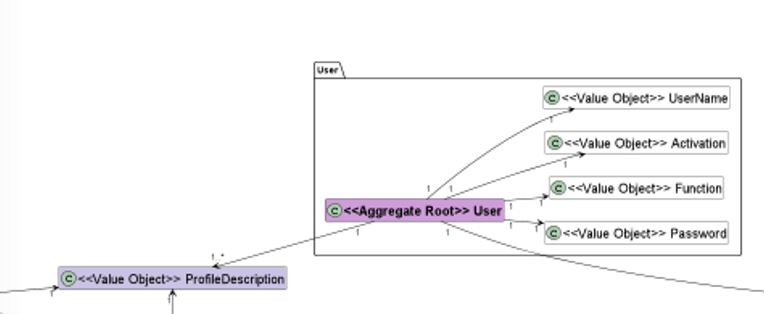

#### [Return Home](/docs/README.md)
# US04 - Search for users
=======================================

## **1.Requirements Engineering**

### **1.1. User Story Description**

As Administrator, I want to search for users.

### **1.2. Customer Specifications and Clarifications** 
    
**From the specifications document:**

- The administrator should be able to search for users with availability of at least the following fields: email and profile.

**From the client clarifications:**
  
- The PO said that it would be a plus if partial searches were allowed, for example: search for a keyword and find email that match that keyword.

**From Group Discussion:**

After discussing with the team, we decided to create two separate methods:
- Search by email;
- Search by profile;
    

### **1.3. Acceptance Criteria**

* **AC1:** Only the Administrator can search for users.

### **1.4. Found out Dependencies**

* There is a dependency to the [**US001** - *"As Non-Registered User, I want to registar as an application user."*](/docs/sprint-A/US001). When a user registers, he uses an email. This email is what the administrator will type when he wants to search for a user.

* There is also a dependency to the [**US06**  *" As Administrator, I want to update profiles assigned to a user account."*](/docs/sprint-A/US06). The administrator can update profiles and will be able to search for users with that specific profile.

### **1.5. Input and Output Data**

#### **Input Data:**

* **Typed data:**
  - radio button to choose the type of search (by email or profile)
  - searchField (word that will be searched)
   
#### **Output Data:**

- Since the search by email accepts partial searches and there are several users with a specific profile, the output will be a list of Search User DTO.

### 1.6. System Sequence Diagram (SSD)

### 1.7 Other Relevant Remarks
n/a

## 2. OO Analysis

### 2.1. Relevant Domain Model Excerpt 

### 2.2. Other Remarks
n/a

## 3. Design - User Story Realization 

### 3.1. Rationale

n/a

### Systematization ##

## 3.1. Sequence Diagram (SD)

Search user by email

Search user by Profile

## 3.2. Class Diagram (CD)

Search user by email

Search user by Profile

## 3.3. Use Case Diagram (CD)

Search user by email

# 4.1 Integration Tests (Controller Layer)

**Integration test 1:** Get Users By Email Succesfully.

**Integration test 1:** Get Users By Profile Succesfully.

# 4.2 Unit Tests (Application Layer)

**Unit test 1:** Search by an existing email, returning a list with that user.

**Unit test 2:** Search by email, returning an empty list (no users found).

**Unit test 3:** Search by an existing profile, returning a list with that user.

**Unit test 4:** Search by profile, returning an empty list (no users found).

# 5. Construction (Implementation)

# 6. Integration and Demo

# 7. Observations

n/a

