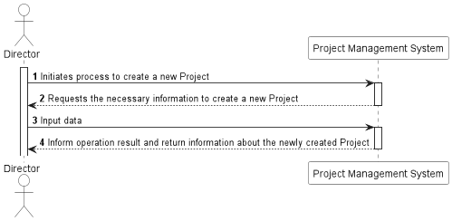
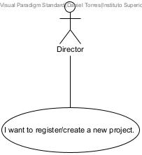

US005 - I want to register / create a new project
=======================================

## **1.Requirements Engineering**

### **1.1. User Story Description**

As Director, I want to register / create a new project.

### **1.2. Customer Specifications and Clarifications**

**From the specifications document:**

Each project must have at least the following information:  

- Code (unique alphanumerical identifier for each project);
- Project manager (user who will have the project manager profile for that record);
- Name;
- Description;
- Start Date;
- Sprint duration (initial estimate);
- Number of planned sprints;
- End Date (date it was closed);
- Customer;
- Business Sector;
- Typology (Fixed Cost / Time and materials);
- Product Owner (may change over time);
- Scrum Master (may change over time);
- Project team (may change over time);
- Project Status (Planned / Inception / Elaboration / Construction / Transition / Warranty / Closed);
- Budget (monetary amount available for resource spending).

> When creating a project on the system, a user is defined as the manager of that project.

**From the client clarifications:**

> When creating a project on the system, project status is "Planned" by default.

### **1.3. Acceptance Criteria**

<b>AC1:</b> A Director must be able to create a new project, with a project code that is not currently in the system

<b>AC2:</b> The project code, name, description, start date, sprint duration, number of planned sprints, end date, customer name, business sector, typology description, budget and project manager
email must follow the domain rules established

<b>AC3:</b> The project code shall serve as the identifier of a project

<b>AC4:</b> There can't be more than one project with the same project code in the system

<b>AC5:</b> The customer name defined at project creation must be in the system

<b>AC6:</b> The typology description defined at project creation must be in the system

<b>AC7:</b> The email of the project manager defined at project creation must be in the system

<b>AC8:</b> If a Project is successfully created, a representation of said project with a link to get it should be returned along with the created HTTP status

<b>AC9:</b> If the requirements described in AC2 and AC7 are not met, an HTTP status of bad request should be returned

### **1.4. Input and Output Data**

#### **Input Data:**

* **Typed data:**
  - Code
  - Name
  - Description
  - Sprint duration
  - Number of planned sprints
  - Business Sector
  - Budget

* **Selected data:**
  - Start date
  - End date
  - Customer name
  - Typology description
  - Project manager email

#### **Output Data:**

- JSON with link to get the created Project and a created HTTP status should be returned

### **1.5. System Sequence Diagram (SSD)**

### 1.7 Other Relevant Remarks

n/a

## 2. OO Analysis

### 2.1. Business Rules

The Project creation and it's value objects have the following business rules:

| **_Value Objects_**               | **_Business Rules_**                                                                                                                |
|:----------------------------------|:------------------------------------------------------------------------------------------------------------------------------------|
| **ProjectStatus**                 | String with one of the following options : "Planned", "Inception", "Elaboration", "Construction", "Transition", "Warranty", Closed" |
| **TypologyDescription**           | Alphanumerical must be within 1 and 50 characters.                                                                                  |
| **CustomerName**                  | Alphanumerical must be within 3 and 50 characters.                                                                                  |
| **ProjectCode**                   | Alphanumerical must have 5 characters.                                                                                              |
| **ProjectName**                   | Alphanumerical must be within 5 and 50 characters.                                                                                  |
| **ProjectDescription**            | Alphanumerical must be within 5 and 50 characters.                                                                                  |
| **ProjectBusinessSector**         | Alphanumerical must be within 5 and 50 characters.                                                                                  |
| **Time**                          | String format must be "dd/MM/aaaa". Time must be within today and end date.                                                         |
| **ProjectNumberOfPlannedSprints** | Integer must be within 1 and 999.                                                                                                   |
| **ProjectBudget**                 | Double must be within 0 and 999999999.99.                                                                                           |
| **ProjectSprintDuration**         | Integer must be within 1 and 9.                                                                                                     |

### 2.2. Relevant Domain Model Excerpt

The following is the domain model excerpt considered relevant to this US.

[LINK](DomainModelExcerpt/DDD-project.puml)

## 3. Design - User Story Realization

## 3.1. Sequence Diagram (SD)

This user story starts with a Director wanting to create a new project. 

To do this, the Director must insert the code, name, description, sprint duration, business sector and budget; and select
start date, end date, customer name, typology description and project manager email. Project status is "Planned" by default.

If these requirements are met, a new Project will be created in the system.

[LINK](Views/Process_View/ProcessView-C4-Sequence_Diagram/us005sd.puml)

## 3.2. Class Diagram (CD)

[LINK](Views/Implementation_View/ImplementationView-C4-Class_Diagram/ImplementationView-C4-CD.puml)

## 3.3. Use-Case Diagram

# 4. Tests

Test scenarios created for this US (relevant integration tests).

**TEST 1:** Creation of new Project fails due input data does not respect the business rules established.

**TEST 2:** Creation of new Project fails due input project code already existing for a Project in the database.

**TEST 3:** Creation of new Project fails due input customer name that don't exist in the database.

**TEST 4:** Creation of new Project fails due input typology description that don't exist in the database.

**TEST 5:** Creation of new Project fails due input email (pm) that don't exist in the database.

**TEST 6:** Creation of new Project is successful and a representation of said Project with a link to get it should be returned, along with the created HTTP status.

