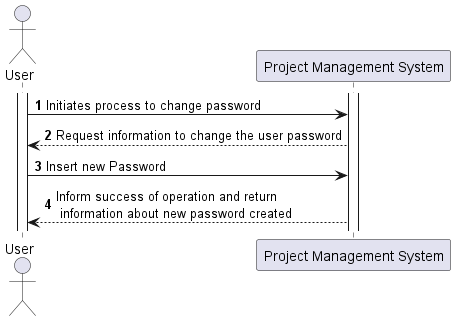
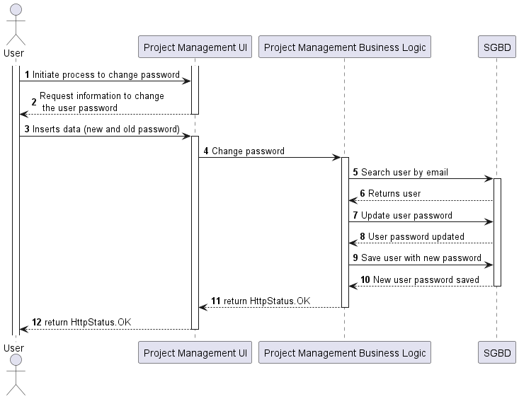
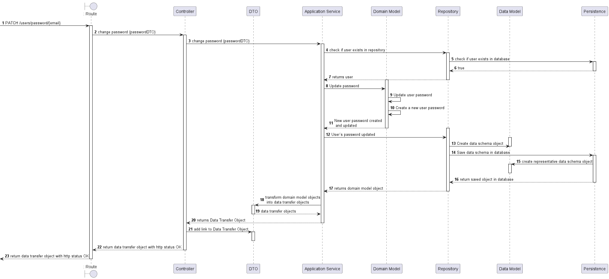
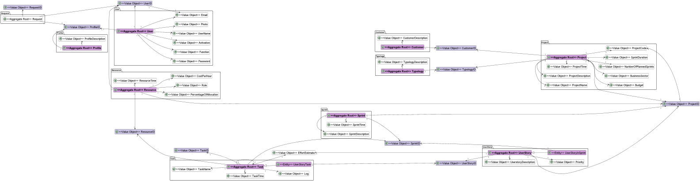
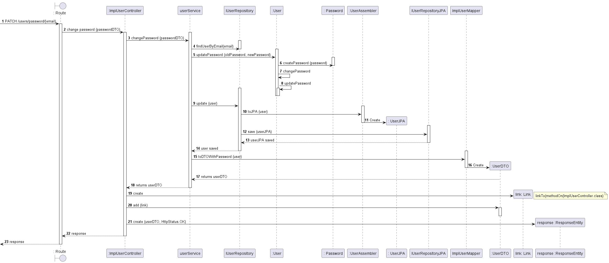
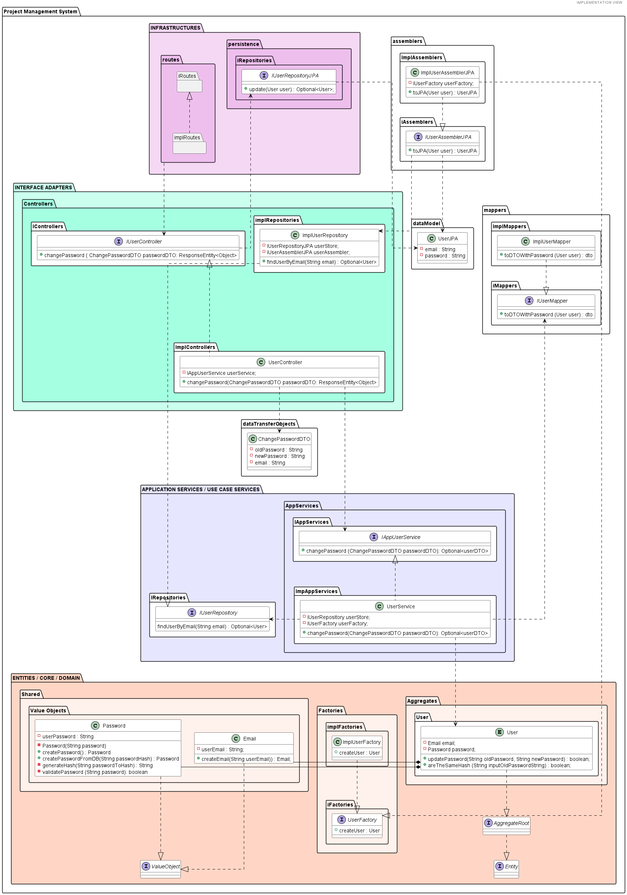
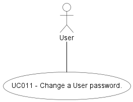

# US011 -  As Authenticated User, I want to change his/her password.
=======================================

## **1.Requirements Engineering**

### **1.1. User Story Description**

As Authenticated User, I wanto to change his/her password
    
### **1.2. Customer Specifications and Clarifications**

**From the specifications document:**

- To get acess to the system a user must enter credentials in the forma of email and 
password.
- Each user's registration must request some information like password and password confirmation;
- The login form shold have a link that allows users to reset their passwords.
- Passwords should not be openly saved to the database allowing them ti be read or decrypted by a user with acess 
to the database.

**From the client clarifications:**
- A password can only be stored encrypted.

**From Group Discussion:**

After meeting with the Product Owner and meeting in group we achieved the following conclusions:
- When the password is created, a method for encryption must be generated;
- For change the atual password, a user must introduce the old password first, to confirm the user validation and,
  only before that, put the new one.

### **1.3. Acceptance Criteria**

* **AC1** To change the user's password, the user's email must be present, as well as a previously created password when creating the user.
* **AC2** To be possible to change a password, the old and the new password must be different; 
* **AC3** To create or change a password we must respect a series of validations such as the length of the password 
and the requirement for special characters.
* **AC4** When you create a new user, a password must be created.
* **AC5:** If the user exists and the password is successfully changed, a userDTO must be created with the link,
along with an HTTP status Ok.
* **AC6:** The code for this user story should be covered by tests, unit and integration mainly.

### **1.4. Found out Dependencies**

* There is a dependency to [**US001** - *"As Non-Registered User, I want to register as an application user"*]

### **1.5. Input and Output Data**

#### **Input Data:**

* **Typed data:**
    - String oldPassword;
    - String newPassword;
    - String passwordToHash;
    - int id;
 

#### **Output Data:**

- Return JSON with link to change user password;
- HttpStatus.OK should be return;

### **1.6.Process View: System Sequence Diagrams (SSD)**

#### **Level 1**

#### **Level 2**

#### **Level 3**

### 1.7 Other Relevant Remarks
n/a

## 2. OO Analysis

### 2.1. Business Rules
For chante the user´s password, the value object necessary to obtain them is the following one,
which must follow some business rules:

| **_Value Objects_** | **_Business Rules_**                                                                                                              |
|:--------------------|:----------------------------------------------------------------------------------------------------------------------------------|
| **Password**        | Alphanumerical characters with minimnun size 8 and maximun 20. Must have a special caracter and must contain letters and numbers. |

### 2.2. Relevant Domain Model Excerpt
Below is an excerpt of the domain model considered relevant for this US.

## 3. Design - User Story Realization

## 3.1. Sequence Diagram (SD)
This user story starts with a Authenticated User (we do not have the authentication yet) wanting change his/her password. 

After finding the user by email, it´s time to change his/her password.

## 3.2. Implementation View - Level 4: Class Diagram (CD)

Bellow is the class diagram, that describes the attributes and operations of a class and also the constraints imposed on the system.
With this class diagram we can overview all the dependencies and realizations between classes and layers.

## 3.3. Use Case Diagram

This US represents the user's password change. 

## 4. Tests Scenarios

## 4.1. Unit Tests

Unit tests focus on one part of the application in complete isolation. Ideally the tested component is free of side 
effects, hence it is so easy to isolate.

- **Application Services**:

**Test 1:** Change password successfuly

**Test 2:** Change password failure with an exception

- **UserController**

**Test 3:**  Change password successfuly

**Test 4:** Change password failure

**Test 5:** Change password failure with an exception

- **PasswordTest**

**Test 6:** Password with same value

**Test 7:** Password with null input

**Test 8:** With different passwords

**Test 9:** If password is valid

**Test 10:** User password correct, incorrect and equals

**Test 11:** User password from BD failure

## 4.2. Integration Tests
(using mockMvc)

**Test 12:** Change user´s password successfuly, returns link and HTTP Status OK;

**Test 13:**  Change user´s password failure, returns a Bad Request HTTP Status, along with message "Operation failed."

# 5. Implementation

We implemented the **Onion Archictecture**, as we can see by looking at the implementation and logic views.

# 6. Observações

We used scrum for this project management system and we implement different principles like:

- **Grasp**;
- **SOLID**;
- **DDD**;
- **ONION Architecture**;
- **FLUX**;
- **SPRINGBOOT**;

among others.

