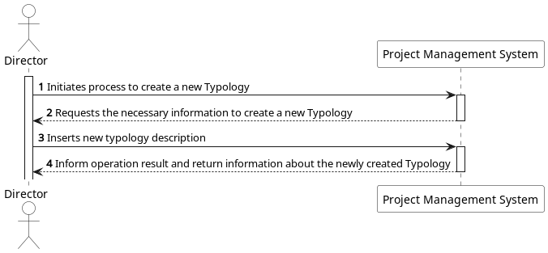
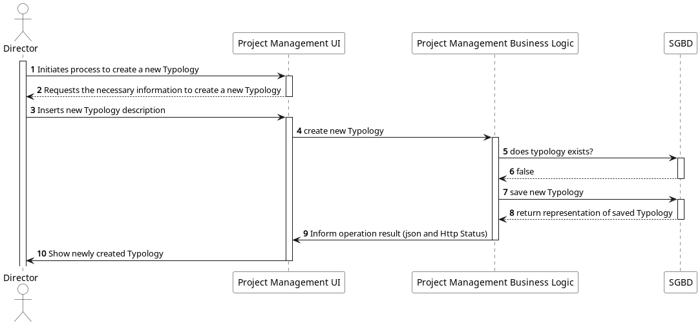
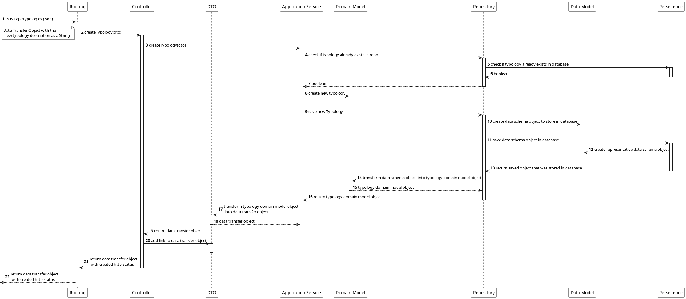
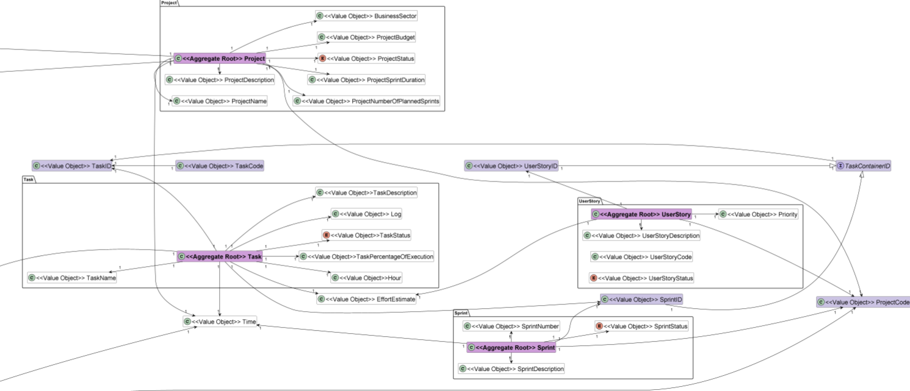
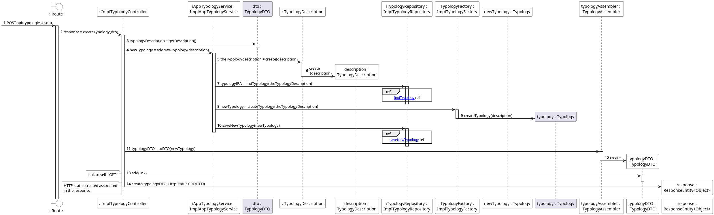
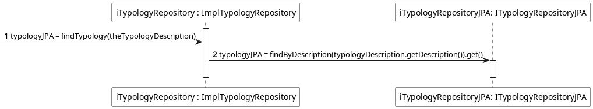
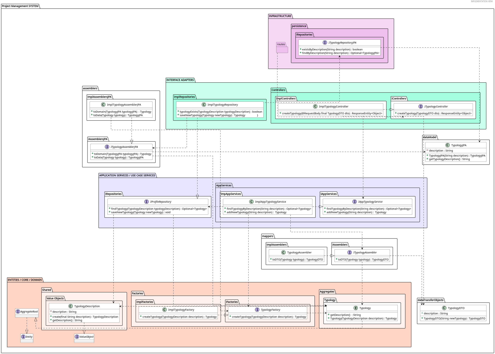
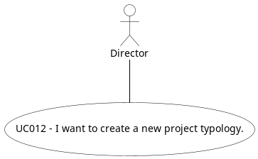

# US 012 -  I want to create a new project typology

## 1. Requirements Engineering

### 1.1. User Story Description

As a Director, I want to create a new project typology

### 1.2. Customer Specifications and Clarifications

**From the specifications document:**

The only specification found in the document were two examples of typologies, those being "Fixed Cost / Time and materials".

**From the client clarifications:**

No questions were needed to be asked to the client regarding this UserStory.

### 1.3. Acceptance Criteria

* **AC1:** The new typology must not be repeated, or existant in the sytem.
* **AC2:** The typology can be associated directly to a project or not.
* **AC3:** The typology description can't be null.
* **AC4:** The typology description must at least one character and less than 50.
* **AC5:** The typology description can't be only white spaces.

### 1.4. Found out Dependencies

* There aren't any relevant dependencies in this user story.

### 1.5 Input and Output Data

**Input Data:**

* Typed data:
    * Typology description

* Selected data:
    * UserStory's project
    * The UserStory
    * The sprint that the UserStory will be moved into

**Output Data:**

* The newly created Typology
* Links to the newly created typology
* (In)Success of the operation

### **1.6.Process Views: System Sequence Diagrams (SSD)**

#### **Level 1**

#### **Level 2**

#### **Level 3**

## 2. OO Analysis

### 2.1. Business Rules

There are no business rules specifically for this US. 

### 2.2. Relevant Domain Model 

## 3. Design - User Story Realization

## 3.1. Process View - Level 4: Sequence Diagram (SD)

In this US, we're intended, as a Director to create a new Typology.
The flow we follow in this sequence diagram show us how the system behaves when creating a ne typology. 
Bellow we can see the general view of the entire process. 

We can also check some of the refs present in the Sequence Diagram above. 

**Find**

**Save**

## 3.2. Implementation View - Level 4: Class Diagram (CD)

Bellow is the class diagram, that describes the attributes and operations of a class and also the constraints imposed on the system.
With this class diagram we can overview all the interactions between classes and layers.

## 3.3. Use Case Diagram

This User Story represents the case where we intend to create a new typology. 

## 4. Tests Scenarios

## 4.1. Unit Tests

- **Application Services**:

**TEST 1:** Checks if new typology is successfully created;

**TEST 2:** Creation fails because typology already exists;

## 4.2. Integration Tests
(using mockMvc)

**TEST 3:** Create Typology sucessfully, returning a Typology and an HTTP response.

**TEST 4:** Create Typology unsucessfully, returning an exception.

## 6. Observations

Throughout working in this project we had to implement different principles, frameworks and so on, through the refactor
of our code which we did many times.

Therefore, I find it important to refer some of these concepts we applied onto our project:

* **GRASP**;
* **SOLID**;
* **DDD**;
* **REST**;
* **ONION Architecture**;
* **FLUX**;
* **SPRINGBOOT**;
* and so on...

