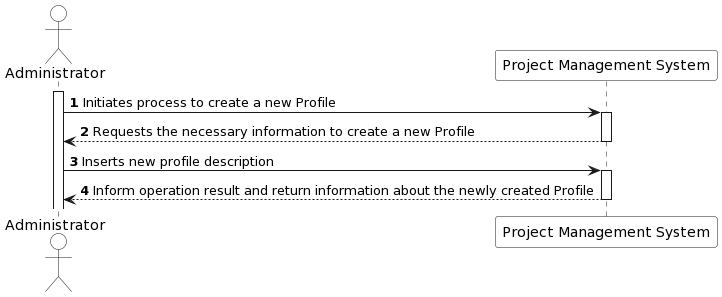
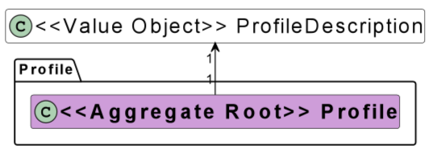
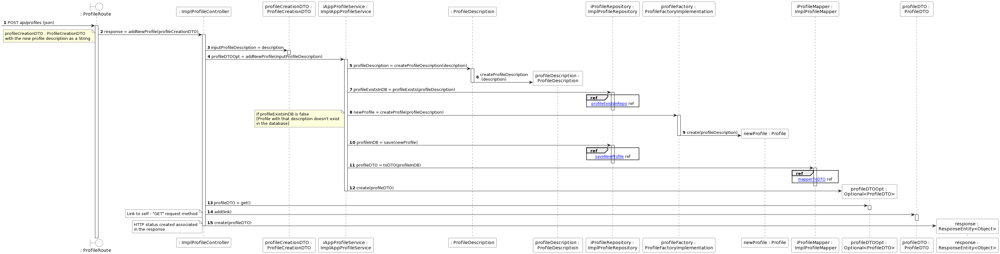
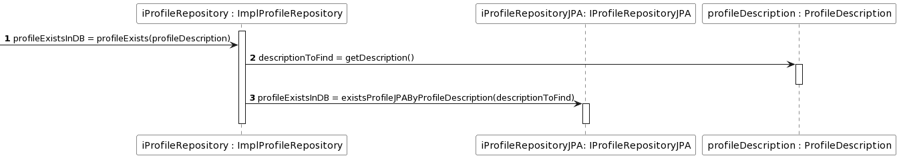
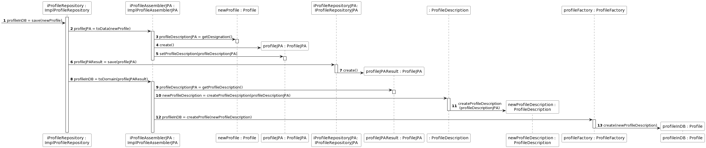
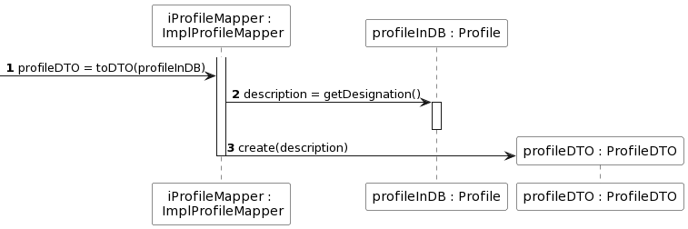
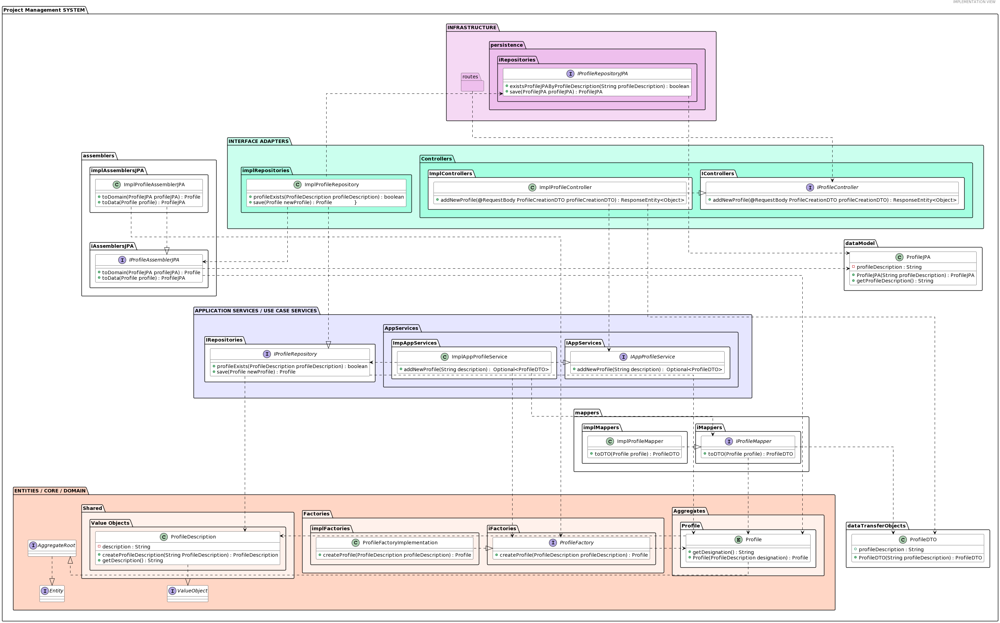
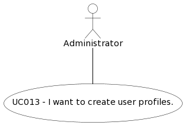

#### [Return Home](/docs/README.md)
# US013 - I want to create user profiles.
=======================================

## **1.Requirements Engineering**

### **1.1. User Story Description**

As Administrator, I want to create user profiles.

### **1.2. Customer Specifications and Clarifications** 
    
**From the specifications document:**

- About Profiles:
>The system should allow the configuration of profiles associated with users, in order to restrict access to features. 
> Each profile will have permissions associated with available actions and functionalities. A user account can have one
> or more profiles.

**From the client clarifications:**

- User Story requirements not specified in client clarifications.

**From Group Discussion:**

After meeting in group we achieved the following conclusions:

  - The Profile should be an Aggregate and have a descirption which also serves as its identifier.
  
### **1.3. Acceptance Criteria**

* **AC1:** A administrator must be able to create a new Profile with a description that is not currently in the system
* **AC2:** The Profile description must follow the domain rules estabilished for the profile description
* **AC3:** The Profile description shall serve as the identifier of a Profile
* **AC4:** There can't be more than one Profile with the same description in the system
* **AC5:** If a Profile is successfully created, a representation of said Profile with a link to get it should be returned along with the created HTTP status
* **AC6:** If the requirements described in AC2 and AC5 are not met, an HTTP status of bad request should be returned

### **1.4. Found out Dependencies**

* There is a dependency with [**US006** - *"As Administrator, I want to update profiles assigned to a user account."*]. The Administrator 
shall be able to associate the created profiles to user accounts.

### **1.5. Input and Output Data**

#### **Input Data:**

* **Typed data:**
  - Profile description;

* **Selected data:**
  - N/A;

#### **Output Data:**

-  JSON with link to get the created Profile and a created HTTP status should be returned

### **1.6. System Sequence Diagram (SSD)**

### 1.7 Other Relevant Remarks
n/a

## 2. OO Analysis

### 2.1. Business Rules
The Profile creation and it's value objects have the following business rules:

| **_Value Objects_**    | **_Business Rules_**                               |
|:-----------------------|:---------------------------------------------------|
| **ProfileDescription** | Alphanumerical must be within 1 and 50 characters. |

### 2.2. Relevant Domain Model Excerpt 
The following is the domain model excerpt considered relevant to this US.

## 3. Design - User Story Realization 

## 3.1. Sequence Diagram (SD)
This user story starts with a administrator wanting to create a new user Profile. To do this
the administrator must insert the description for the new user Profile. This description must be unique and therefore
must not exist in the database. If these requirements are met, a new Profile will be created in the system.

Detailed view of the interaction use relating to checking if the profile exists in the database.

Detailed view of the interaction use relating to saving the news profile in the database.

Detailed view of the interaction use relating to mapping the newly created Profile into a data transfer object.

## 3.2. Class Diagram (CD)

## 3.3. Use-Case Diagram
In this Project most User Stories represent a unique interaction between one or more actors and the system.
This User Story represents the case where a User with the role of Administrator wants to create a new user Profile, as shown bellow.

# 4. Tests
Test scenarios created for this US (relevant integration tests).

**TEST 1:** Creation of new Profile fails due input profile Description does not respect the business rules established for the profile Description.

**TEST 2:** Creation of new Profile fails due input profile Description already existing for a Profile in the database.

**TEST 3:** Creation of new Profile is successful and a representation of said Profile with a link to get it should be returned, along with the created HTTP status.

# 5. Construction (Implementation)

# 6. Integration and Demo

# 7. Observations

n/a

