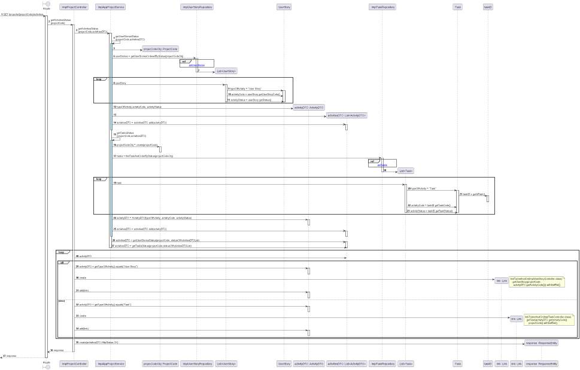

# US016 - View status of activities in a project.
=======================================

## **1.Requirements Engineering**

### **1.1. User Story Description**

As Director/PM/PO/SM, I want to view status of activities in a project.

### **1.2. Customer Specifications and Clarifications** 

**From the specifications document:**

   - ***2.4.3. Record of activities in a project:***

     - Almost all activities in the project are related to these user stories.
     - A user story may include several tasks that have to be done for the user story
to be completed. During the sprint, project team members register work done in these tasks.
     - There may be other technical(e.g. deployment) or general/independent tasks (e.g.
        meetings, etc.) which may happen once or periodically. For example, there may be user stories
        and non-functional requirements related to system deployment, but the actual deployment
        takes place multiple times along the project and there may be an effort related to it. As such,
        there may be a task in each sprint related to deployment (e.g. changes in configuration due to
        implemented user stories, etc.). Meetings also have an effort and many have no relation to
        user stories (e.g. sprint review, sprint retrospective, etc.).
     - The users available for the activities are the team members, the PO and the SM.

     
   - ***2.4.6. View the status of activities in the project:***

   
- The project activity list should have two distinct viewing modes, which can be used 
interchangeably or simultaneously:
     - Table-shaped view;
     - View in Gantt format (by sprint).

**From Group Discussion:**

- Even though in a first approach the PO referred we were only obliged to 
implement User Stories as activities of a project, the group
 decided to also implement Tasks early in our project. 

- Therefore, when wanting to view the status of all activities in a project
we could see not only the user stories statuses but also the tasks.

- When it comes to view the User Interface and the way to view these statuses we as a group
decided to implement a Table-shaped view in a project.

- As we didn't implement authentication all the users can view the statuses of the activities
within a project.

### **1.3. Acceptance Criteria**

* **AC1:** A user must be able to see the status of all activities of a project.
* **AC2:** The activities must aggregate User Stories and Tasks.
* **AC3:** When there's no activities the User Interface informs the user there's no data
instead of sending an error message.
* **AC4:** There must be a project in existence in the database to see the activities.
* **AC5:** The information shown to the user of the activities incorporates the type of activity, its code and status.
* **AC6:** Have at least a Table-shaped view to show the project activity list to a user.
* **AC7:** If the selected project exists then, having or not, activities it should be returned a link to get them,
along with an HTTP status Ok.
* **AC8:** In the case the AC4 requirement is not met then an HTTP status of bad request should be returned.
* **AC9:** The code for this user story should be covered by tests, unit and integration mainly.

### **1.4. Found out Dependencies**

- There is a dependency to ***US009 - "As Product Owner, I want to create a user story and add 
it to the Product Backlog."*** because user stories are part of the activities of a project.

- The other dependency to this User Story is with the two following user stories:
  - ***US031: "As Team Member, I want to create a task in a user story"***;
  - ***US032 - "As SM/Team Member, I want to create task outside the scope of a user story."***
  - Because Tasks are also a part of the activities of a project.

### **1.5. Input and Output Data**

#### **Input Data:**

* **Selected data:**
    - Selected Project from a list of Projects;
* **Typed data:**
    - N/A

#### **Output Data:**
- Return JSON with link to get the statuses of activities in a project;
- HttpStatus.OK should be returned

### **1.6.Process Views: System Sequence Diagrams (SSD)**

#### **Level 1**

#### **Level 2**

Version 1

Version 2

#### **Level 3**

## 2. OO Analysis

### 2.1. Business Rules
For the search of activities the value object necessary to obtain them is the following one,
which must follow some business rules:

| **_Value Objects_**    | **_Business Rules_**                               |
|:-----------------------|:---------------------------------------------------|
| **ProjectCode** | Alphanumerical must have 5 digits. |
| **TaskStatus** | Planned/Running/Finished/Blocked|

### 2.2. Relevant Domain Model Excerpt

As this US has relations with almost every aggregate I chose to add all the domain model, 
because I couldn't separate them.

## 3. Design - User Story Realization 

## 3.1. Process View - Level 4: Sequence Diagram (SD)

This user story starts with a Director/PM/PO/SM wanting to view status of activities in a project,
for this to be possible they must indicate the selected project identified by the project code.

After finding the project then it is time to search for all the activities of a project, meaning 
there's a search for user stories and/or tasks.

Bellow is also added the detail view of the sequence diagram where we get the user stories 
ordered by status.

Next we have the detailed view of the interaction use of finding tasks, ordering them by status.

## 3.2. Implementation View - Level 4: Class Diagram (CD)

Bellow is the class diagram, that describes the attributes and operations 
of a class and also the constraints imposed on the system.
With this class diagram we can overview all the dependencies and realizations between classes and layers.

## 3.3. Use Case Diagram 

This User Story represents the case where there are different users with different roles who want to view the
status of activities in a project. These Users have the role of Director, PM, PO or SM, as shown bellow.

## 4. Tests Scenarios

## 4.1. Unit Tests

- **Application Services**:

**TEST 1:** Get successfully the status of user stories in a project;

**TEST 2:** Get successfully the status of tasks in a project;

**TEST 3:** Get successfully the status of all activities in a project;

**TEST 4:** View status of activities fails because project doesn't exist.

- **Interface Adapters**:

**TEST 5:** Get status of activities in a project is successful, returning a link along with the HTTP Status Ok.

**TEST 6:** Get status of activities in a project fails because project doesn't exist, returning a Bad Request HTTP Status. 

## 4.2. Integration Tests
(using mockMvc)

**TEST 7:** Activities Status Succesfully Fetched, returns link and HTTP Status OK ;

**TEST 8:** Activities Status Unsuccessfully Fetched Because Project Doesn't Exist, returns 
a Bad Request HTTP Status, along with the message "Project doesn't exist!";

## 5. Implementation

We implemented in our application the concepts on **Onion Architecture**, separating our classes, creating interfaces, all of
this using different layers.

We also implemented **Domain Driven Design (DDD)**, having Aggregates and Value Objects, keeping in mind all the business rules
imposed to us, and refactoring what we had because of this.

We tried to run from STUPID principles - for example we had the Singleton Principle applied and being used with our 
Data Management which had too many responsibilities. 

We ended this, for example by creating factories and by separating responsibilities between classes.

## 6. Integration and Demo

* In the Projects option, when choosing a project we see all the information of that project. 
There it was added an option to view its activities.

* To view the activities it was chosen to present a Table-shaped view, with the type of activity, code and status.

## 7. Observations

Throughout working in this project we had to implement different principles, frameworks and so on, through the refactor 
of our code which we did many times.

Therefore, I find it important to refer some of these concepts we applied onto our project:

* **GRASP**;
* **SOLID**;
* **DDD**;
* **REST**;
* **ONION Architecture**;
* **FLUX**;
* **SPRINGBOOT**;
* and so on...
