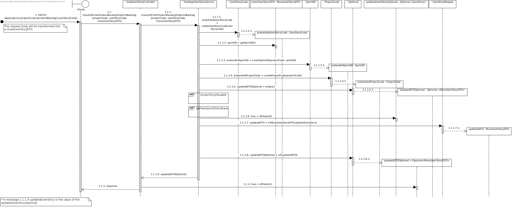

# US 023 -  To add a user story in the product backlog to the sprint backlog

## 1. Requirements Engineering


### 1.1. User Story Description


As Team Member, I want to add a user story in the product backlog to the sprint backlog


### 1.2. Customer Specifications and Clarifications 


**From the specifications document:**

Our team did not found any relevant remarks int the specifications document, regarding this UserStory.


**From the client clarifications:**

No questions were asked to the client regarding this UserStory.


### 1.3. Acceptance Criteria


* **AC1:** There must be provided a valid project identifier.
* **AC2:** The project status cannot be *closed*.
* **AC3:** There must be provided a valid sprint identifier.
* **AC4:** The sprint status must not be *finished*.
* **AC5:** There must be provided a valid UserStory identifier.
* **AC6:** The UserStory must be in the product backlog.
* **AC8:** The UserStory status must not be *finished*.


### 1.4. Found out Dependencies


* There is a dependency to "US005 - As Director, I want to register/create a new project. " since a project must exist and be identified.
* There is a dependency to "US009 - As Product Owner, I want to create a user story and add it to the Product Backlog. " since a UserStory must exist and be identified.
* There is a dependency to "US022 - As Project Manager, I want to create a sprint. " since a sprint must exist and be identified.


### 1.5 Input and Output Data


**Input Data:**

* Typed data:
    * N/A 
	
* Selected data:
	* UserStory's project
	* The UserStory
	* The sprint that the UserStory will be moved into


**Output Data:**

* The updated UserStory
* Links to the updated UserStory and to the sprint that it was moved into
* (In)Success of the operation

### 1.6. System Sequence Diagram (SSD)





### 1.7 Other Relevant Remarks

* The moved UserStory status will not change.

## 2. OO Analysis

### 2.1. Relevant Domain Model Excerpt 


### 2.2. Other Remarks

n/a

## 3. Design - User Story Realization 

### 3.1. Sequence Diagram (SD)


## 3.3. Class Diagram (CD)


# 4. Tests 

## Integration tests

The integration tests will not be displayed due to their size.

**Test 1:** When every required field is present and valid the return should be an HTTP status 200 and the updated UserStory DTO with links to the UserStory and the sprint.

**Test 2:** When the project is not found the return should be an HTTP status 400. 

**Test 3:** When the sprint is not found the return should be an HTTP status 400.

**Test 4:** When the UserStory is not found the return should be an HTTP status 400.

## Relevant Unit Tests

**Test 1** When the project status is closed the return should be false.
```
@Test
    void shouldReturnFalseWhenTheProjectStatusIsClosed() {
        Project projectMock = mock(Project.class);
        Sprint sprintMock = mock(Sprint.class);
        UserStory userStoryMock = mock(UserStory.class);

        when(projectMock.isProjectClosed()).thenReturn(true);

        assertFalse(userStoryDomainService.
                canUSBeMovedFromProductBacklogToSprintBacklog(projectMock,
                sprintMock,
                userStoryMock));
    }
```

**Test 2** When the sprint status is closed the return should be false.

```
@Test
    void shouldReturnFalseWhenTheSprintStatusIsFinished() {
        Project projectMock = mock(Project.class);
        Sprint sprintMock = mock(Sprint.class);
        UserStory userStoryMock = mock(UserStory.class);

        when(sprintMock.isSprintStatusFinished()).thenReturn(true);

        assertFalse(userStoryDomainService.
                canUSBeMovedFromProductBacklogToSprintBacklog(projectMock,
                        sprintMock,
                        userStoryMock));
    }
```

**Test 3** When the UserStory status is finished the return should be false.

```
@Test
    void shouldReturnFalseWhenUserStoryStatusIsFinished() {
        Project projectMock = mock(Project.class);
        Sprint sprintMock = mock(Sprint.class);
        UserStory userStoryMock = mock(UserStory.class);

        when(userStoryMock.isUserStoryStatusFinished()).thenReturn(true);

        assertFalse(userStoryDomainService.
                canUSBeMovedFromProductBacklogToSprintBacklog(projectMock,
                        sprintMock,
                        userStoryMock));
    }
```

**Test 4** When the UserStory is not in the product backlog the return should be false.

```
@Test
    void shouldReturnFalseWhenUserStoryIsNotInProductBacklog() {
        Project projectMock = mock(Project.class);
        Sprint sprintMock = mock(Sprint.class);
        UserStory userStoryMock = mock(UserStory.class);

        when(userStoryMock.isUserStoryInProductBacklog()).thenReturn(false);

        assertFalse(userStoryDomainService.
                canUSBeMovedFromProductBacklogToSprintBacklog(projectMock,
                        sprintMock,
                        userStoryMock));
    }
```

**Test 5** When the project status is not closed, the sprint status is not finished, the UserStory status is not finished and the UserStory is in the product backlog the return should be true.

```
@Test
    void shouldReturnTrueWhenUserStoryIsIsInProductBacklogAndTheStatusesAreNotClosed() {
        Project projectMock = mock(Project.class);
        Sprint sprintMock = mock(Sprint.class);
        UserStory userStoryMock = mock(UserStory.class);

        when(projectMock.isProjectClosed()).thenReturn(false);
        when(sprintMock.isSprintStatusFinished()).thenReturn(false);
        when(userStoryMock.isUserStoryStatusFinished()).thenReturn(false);
        when(userStoryMock.isUserStoryInProductBacklog()).thenReturn(true);

        assertTrue(userStoryDomainService.
                canUSBeMovedFromProductBacklogToSprintBacklog(projectMock,
                        sprintMock,
                        userStoryMock));
    }
```

# 5. Integration and Demo 

* A new action on the UserStory details page actions was added.


# 6. Observations

N/A


