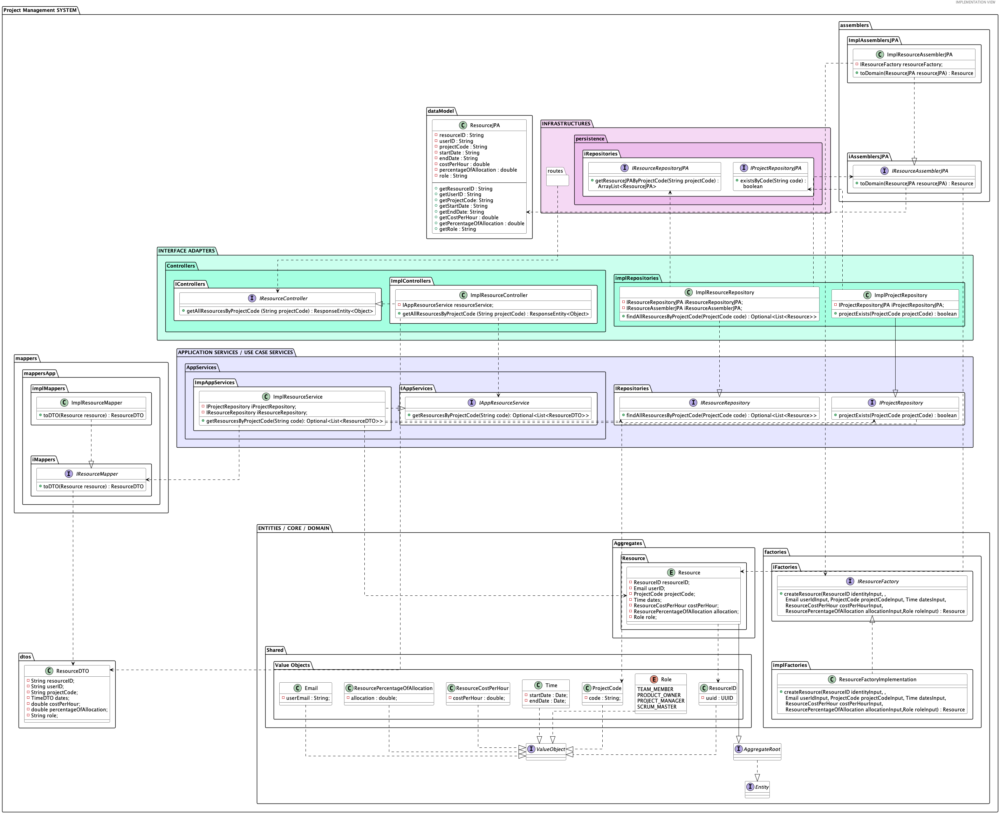

#### [Return Home](/docs/README.md)
# US028 - I want to get a list of all human resources in a project
=======================================

## **1.Requirements Engineering**

### **1.1. User Story Description**

As Director, I want to get a list of all human resources in a project

### **1.2. Customer Specifications and Clarifications** 

**About Resources:**

 The system does not allow resources without projects.
Each resource is always associated with a specific project.

**From the client clarifications:**

G6, 25/01

> **Question:** * "Pretende visualizar os recursos ativos ou todos aqueles que já participaram no projeto?" 
**Answer:** * "PO Todos afetos ao projeto. (AMM, 27/01)"

G3, 31/01

> **Question:** * "Que informações devem ser devolvidas/fornecidas ao utilizador do sistema sobre os recursos humanos alocados a um determinado projecto. Basta, por exemplo, o nome e e-mail dos recursos ou é necessário fornecer mais dados?"
**Answer:** * "PO Nome, email e função parecem adequados. (AMM, 03/02)"
>
  
### **1.3. Acceptance Criteria**

* **AC1:** A director must be able to get a list of all human resources in a project with project code
* **AC2:** The Project code must follow the domain rules estabilished for the project code.
* **AC3:** When there's no resources the User Interface informs the user there's no data
    instead of sending an error message.
* **AC4:** There must be a project in existence in the database to see the resources.
* **AC5:** There can't be more than one Project with the same code in the system.
* **AC6:** The Project Code shall serve as the identifier of a Project
* **AC7:** If get a list of all human resources in a project is successfully ok, a representation of said Resources with a link to get it should be returned along with the ok HTTP status
* **AC8:** If the requirements described in a AC2, AC4 and AC5 are not met, an HTTP status of bad request should be returned.
* **AC9:** The code for this user story should be covered by tests, unit and integration mainly.

### **1.4. Found out Dependencies**

* There is a dependency with [**US005** - *"As Director, I want to register/create a new project."*]. In order to get the resources of a project, we need a created project with Resources allocated.
* 
### **1.5. Input and Output Data**

#### **Input Data:**

* **Selected data:**
  - Selected Project from a list of Projects;
  
* **Typed data:**
  - N/A

#### **Output Data:**

- JSON with link to get the list of human resources in a project.
- HTTP status OK should be returned

### **1.6. System Sequence Diagram (SSD)**

## **Level 1**

)

## **Level 2**

## **Level 3**

## 2. OO Analysis

### 2.1. Business Rules
For the search of resources in a project the value object necessary to obtain them is the following one, which must follow some business rules:

| **_Value Objects_** | **_Business Rules_**               |
|:--------------------|:-----------------------------------|
| **ProjectCode**     | Alphanumerical must have 5 digits. |

### 2.2. Relevant Domain Model Excerpt 
The following is the domain model excerpt considered relevant to this US.

## 3. Design - User Story Realization 

## 3.1. Process View - Level 4: Sequence Diagram (SD)
This user story starts with a director wanting to view the list of all human resources in a project.  For this to be possible they selected project identified by the project code.

 #### After finding the project then it is time to search for all the resources of a project.

 #### Detailed view of the interaction use relating to checking if the project exists in the database.

#### Detailed view of the interaction use relating to mapping the object jpa into a domain object

 

 #### Detailed view of the interaction use relating to mapping the Resource into a data transfer object.

## 3.2. Implementation View - Level 4: Class Diagram (CD)

## 3.3. Use-Case Diagram
In this project and in all projects, all User Stories represent a unique interaction between one or more actors and the system. In the case of this US, it represents the case where a user with the role of Director wants to search for a list of all the human resources of a project.

# 4. Tests
Test scenarios created for this US (relevant integration tests).

**TEST 1:** All Human Resources Succesfully Fetched, returns link and HTTP Status OK ;

**TEST 2:**  All Human Resources  Fetched Because Project Doesn't Exist, returns a Bad Request HTTP Status, along with the message ""Selected project does not exist!";

