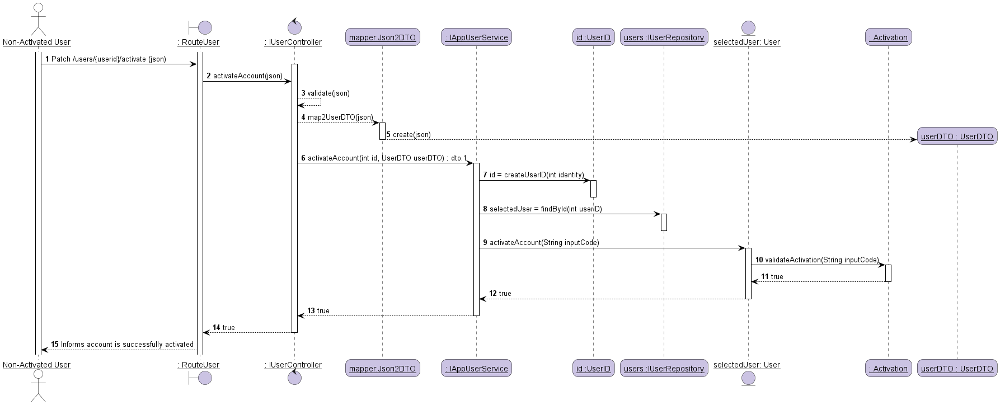

#### [Return Home](/docs/README.md)
# US002 - I want to activate a just registered user account.
=======================================

## **1.Requirements Engineering**

### **1.1. User Story Description**

As Non-Activated User, I want to activate a just registered user account.

### **1.2. Customer Specifications and Clarifications**

**From the specifications document:**

***REGISTRATION AND AUTHENTICATION:*** 

**Security in the registration process**

* Security mechanisms should be implemented in the process of registering users in the system.

**Email registration activation**
  * The user registration process may become more secure if it is supplemented by activating the account via email.
  * When you create a new record, it is created as inactive.
  * At the same time an e-mail message is sent to the user that will allow them to activate the account,
    through a code or an automatic activation link.

**From the client clarifications:**
> **Question:** *Relativamente à US002 - As Non-Registered User, I want to activate a just registered user account - 
>seria necessário pedir ao user as credenciais de login antes do pedido do código de ativação de conta? Ou podemos assumir que o User nunca fez logout aquando do seu registo?*
>
> **Answer:** *"Relativamente à pergunta em si da Gisela Maria Russo De Sousa Araujo, acho que deviam ler melhor o documento fornecido, especialmente o ponto 3.6.2. A linha 6 da página 7 é clara.
Por outro lado, nós não temos nenhum mecanismo de autenticação e autorização implementado neste momento, pelo que não há qualquer forma de saber se fez login ou logout."* (cf. Microsoft Teams, SWitCH 2021-2022 ISEP, Canal Project)

**From Group Discussion:**

For the activation of a just registered user there were two options, activate an account through a link or a code. 
After discussion we decided to create a code with which the user would be able to activate his/her account.

### **1.3. Acceptance Criteria**

* **AC1:** The user email for the just registered user must follow the domain rules established for an email.
* **AC2:** The code inserted must be the same as the one generated by the system.

### **1.4. Found out Dependencies**

* There is a dependency to the [**US001** - *"As Non-Registered User, I want to register as an application user."*](/docs/sprint-A/US001).
Because both User Stories have the objective of creating a task. 
The difference in which the user is registered in the system and where the code for the activation is generated and sent to the user.

### **1.5. Input and Output Data**

#### **Input Data:**

* **Typed data:**
  - String email;
  - String code.
* **Selected data:**
   - Selected User from a list of Users to discover the account to be activated.

#### **Output Data:**

- Account activated.
- Boolean: if the account is successfully activated, returns **true**; otherwise, returns **false**.

### **1.6. System Sequence Diagram (SSD)**

### 1.7 Other Relevant Remarks
n/a

## 2. OO Analysis

### 2.1. Business Rules
The activation and it's value objects have the following business rules:

| **_Value Objects_**         | **_Business Rules_**                                                                                                                                 |
| :-------------------------- | :------------------------------------------------------------------------------------------------------------------------------------------------------ |
| **Email**             | Mandatory, The following restrictions are imposed in the email addresses local-part by using this regex: It allows numeric values from 0 to 9; Both uppercase and lowercase letters from a to z are allowed; Allowed are underscore “_”, hyphen “-” and dot “.”; Dot isn't allowed at the start and end of the local-part; Consecutive dots aren't allowed; For the local part, a maximum of 64 characters are allowed; Restrictions for the domain-part in this regular expression include: It allows numeric values from 0 to 9; we allow both uppercase and lowercase letters from a to z; Hyphen “-” and dot “.” isn't allowed at the start and end of the domain-part; No consecutive dots.

### 2.2. Relevant Domain Model Excerpt
The following is the domain model excerpt considered relevant to this US.

## 3. Design - User Story Realization

## 3.1. Sequence Diagram (SD)
This user story starts with a just registered user wanting to activate their account, 
for this to be possible they must indicate the correct code sent to their email. 
After identifying the user by the generated id and comparing the code inserted with the one generated by the system,
the account will be activated.

## 3.2. Class Diagram (CD)
Bellow is the class diagram, that describes the attributes and operations of a class and also the constraints imposed on the system.

## 3.3. Use-Case Diagram
In this Project most User Stories represent an unique interaction between one or more actors and the system.
This User Story represents the case where a User with the role of Team Member wants to create a task in a User Story, as shown bellow.

# 4. Tests
Test scenarios created for this US.

**UserController**

* For a Success case:

      @Test
      void activationAccountIsSuccessful() {
      
       UserDTO userDTO = new UserDTO();
       userDTO.email = "abc@email.com";
       userDTO.password = "123546Aa@";
       userDTO.userName = "validName";
       userDTO.function = "Tester";
       when(userService.activateAccount(1, userDTO)).thenReturn(true);
     
       ResponseEntity<Object> actual = userController.activateAccount(1, userDTO);
       ResponseEntity<Object> expected = new ResponseEntity<>("User account successfully activated.", HttpStatus.OK);
    
       assertEquals(expected, actual);
      }

* For a Non-Successful case:

      @Test
      void activationAccountIsUnsuccessful() {
       
       UserDTO userDTO = new UserDTO();
       userDTO.email = "abc@email.com";
       userDTO.password = "123546Aa@";
       userDTO.userName = "validName";
       userDTO.function = "Tester";
       when(userService.activateAccount(1, userDTO)).thenReturn(false);

       ResponseEntity<Object> actual = userController.activateAccount(1, userDTO);
       ResponseEntity<Object> expected = new ResponseEntity<>(ERROR_MESSAGE, HttpStatus.NOT_ACCEPTABLE);

       assertEquals(expected, actual);
    }

**UserService**

* An example of a success case test:

    @Test
    void shouldActivateAccountWhenAllArgumentsAreValid() {

      doReturn(true).when(userMock).activateAccount(any());
      doReturn(userMock).when(userStoreMock).findById(any());
      UserDTO userDTO = new UserDTO();
      userDTO.email = "abc@email.com";
      userDTO.password = "123546Aa@";
      userDTO.userName = "validName";
      userDTO.function = "Tester";

      assertTrue(userService.activateAccount(1, userDTO));
    }   

**User**

    @Test
    void activateAccountTrue() throws NoSuchAlgorithmException {
    
     // Arrange
     UserID userID = UserID.createUserID(1);
     Email email = Email.createEmail("ricardohorta@rangers.com");
     Password password = Password.createPassword("123456Aa%");
     UserName userName = UserName.createUsername("Ricardo");
     Function function = Function.createFunction("Magician");
     ProfileID profileID = ProfileID.createProfileID(1);

     User newUser = new User(userID, email, password,
                userName, function, profileID);

     // Act
     String activationCode = newUser.getActivation().getCode();
     boolean result = newUser.activateAccount(activationCode);

     // Assert
     assertTrue(result);
    }

**Activation**

    @Test
    void validInputCode() {
    
     //Arrange
     Activation code = Activation.createActivation();

     //Act
     String activationCode = code.getCode();

     //Assert
     assertTrue(code.validateActivation(activationCode));
    }

# 5. Construction (Implementation)

n/a

# 6. Observations

n/a