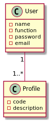
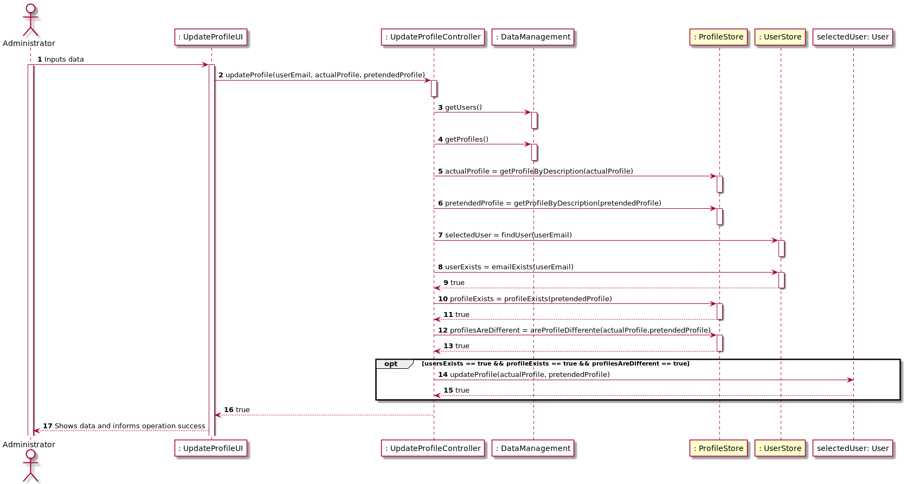
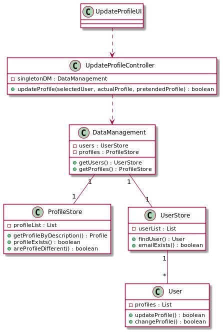
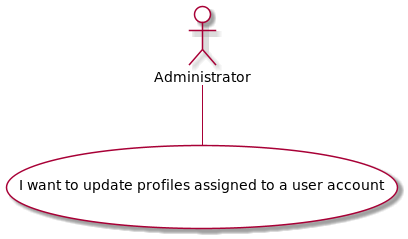

#### [Return Home](/docs/README.md)
# US04 - I want to update profiles assigned to a user account.
=======================================

## **1.Requirements Engineering**

### **1.1. User Story Description**

As Administrator, I want to to update profiles assigned to a user account.

### **1.2. Customer Specifications and Clarifications** 
    
**From the specifications document:**

- The system should allow the configuration of profiles associated with users, in order to restrict
access to features. Each profile will have permissions associated with available actions and
functionalities. A user account can have one or more profiles.
- When registration is made, it is automatically associated with the visitor/guest profile, and
then the administrator can add other available profiles.
- The Administrator profile allows associating profiles with the remaining users of the system,
and therefore an account with this profile should be automatically created at the time the
system is installed.

**From the client clarifications:**
    

**From Group Discussion:**
- After discussing with the team, we decided to create a method that will switch a user's profile by a new one.
    

### **1.3. Acceptance Criteria**

* **AC1:** Only the Administrator can update a user's profile.

### **1.4. Found out Dependencies**

* There is a dependency to the [**US003** - *"As Visitor I want to send a request to the administrator to assign him/her a given profile."*](/docs/sprint-A/US003). The requested profile will be the new profile that the user will receive.

* There is also a dependency to the [**US13**  *" - As Administrator, I want to create user profiles"*](/docs/sprint-B/US13). This profile that are created will be assigned to the users by the Administrator.

### **1.5. Input and Output Data**

#### **Input Data:**

* **Typed data:**
  - email that will receive a new profile.
  - actual profile that will be updated.
  - new pretended profile.
   

### **1.6. System Sequence Diagram (SSD)**

### 1.7 Other Relevant Remarks
n/a

## 2. OO Analysis

### 2.1. Relevant Domain Model Excerpt 

### 2.2. Other Remarks
n/a

## 3. Design - User Story Realization 

### 3.1. Rationale

n/a

### Systematization ##

## 3.1. Sequence Diagram (SD)

## 3.2. Class Diagram (CD)

## 3.3. Use Case Diagram (CD)

# 4. Tests
**Unit test 1:** Sucessfully updating a user's profile for a new one.

**Unit test 2:** fail to update a user's profile when user's email does not exists.

**Unit test 3:** fail to update a user's profile when selected profile does not exist.

**Unit test 4:** fail to update a user's profile when pretended profile does not exist.

# 5. Construction (Implementation)

# 6. Integration and Demo

# 7. Observations

n/a

