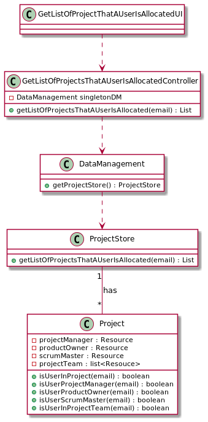

#### [Return Home](/docs/README.md)
# US17 - I want to get a list of all projects I'm currently allocated.
=======================================

## **1.Requirements Engineering**

### **1.1. User Story Description**

As an authenticated User, I want to get a list of all projects I'm currently allocated.

### **1.2. Customer Specifications and Clarifications** 
    
**From the specifications document:**

- 

**From the client clarifications:**
    

**From Group Discussion:**
- After discussing with the team, we decided to create a method that will loop through all projects and verify in which ones the user is allocated.
    

### **1.3. Acceptance Criteria**

* **AC1:** An Authenticated User can see in which projects he is allocated.

### **1.4. Found out Dependencies**

### **1.5. Input and Output Data**

#### **Input Data:**

* **Typed data:**
  - user email that we want to see the projects he is allocated.
   
#### **Output Data:**

- List of Projects

### **1.6. System Sequence Diagram (SSD)**

### 1.7 Other Relevant Remarks
n/a

## 2. OO Analysis

### 2.1. Relevant Domain Model Excerpt 

### 2.2. Other Remarks
n/a

## 3. Design - User Story Realization 

### 3.1. Rationale

n/a

### Systematization ##

## 3.1. Sequence Diagram (SD)

## 3.2. Class Diagram (CD)

## 3.3. Use Case Diagram (CD)

# 4. Tests
**Unit test 1:** Get list of projects when user is allocated in a single project as a Product Owner.

**Unit test 2:** Get list of projects when user is allocated in a single project as a Project Manager.

**Unit test 3:** Get list of projects when user is allocated in a single project as a Scrum Master.

**Unit test 4:** Get list of projects when user is allocated in a single project as part of the Project Team.

**Unit test 5:** Get list of projects when user is not allocated in any project.

**Unit test 3:** Get list of projects when user is allocated in a project several times.

# 5. Construction (Implementation)

# 6. Integration and Demo

# 7. Observations

n/a

