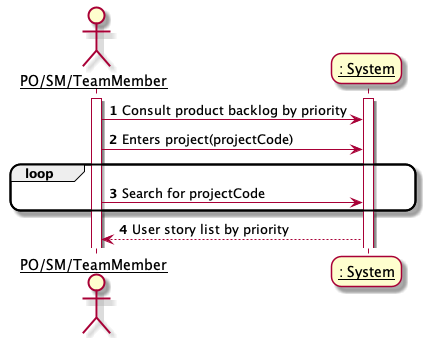
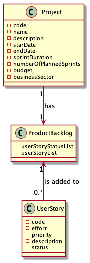
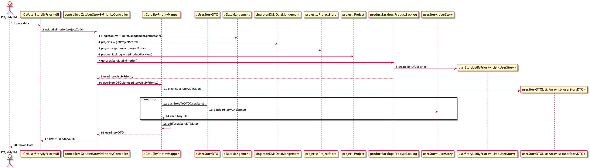
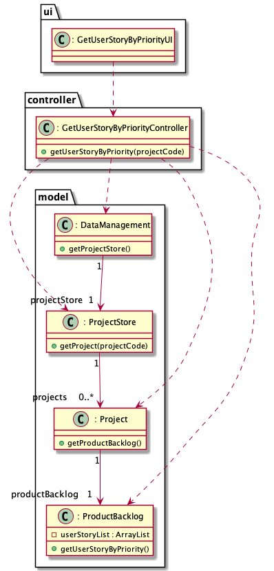
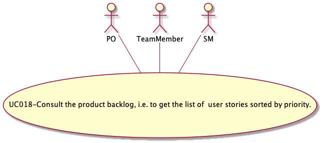

#### [Return Home](/docs/README.md)

# US018 - As PO/SM/Team Member, I want to consult the product backlog, i.e. to get the list of user stories sorted by priority.
=======================================

## **1.Requirements Engineering**

### **1.1. User Story Description**

As PO/SM/Team Member, I want to consult the product backlog, i.e. to get the list of 27 user stories sorted by priority.

### **1.2. Customer Specifications and Clarifications**

**From the specifications document:**

- User Story requirements not specified in the specifications documents.

**From Group Discussion:**

After meeting with the Product Owner and meeting in group we achieved the following conclusions:

- When a project is created, its Product Backlog is also created.
- User Stories are always stored in the Product Backlog in order of priority, that is, from highest to lowest priority.
- The final list that is passed to the user is mapped in dto.

### **1.3. Acceptance Criteria**

* **AC2:** The project code must correspond with a project present in the project store.

### **1.4. Found out Dependencies**

* There is a dependency to the [**US009** - *"As Product Owner, I want to create a user story and add it to the Product
  Backlog."*](/docs/sprint-A/US009). because without creating a user story the returned list will always be an empty
  list.

### **1.5. Input and Output Data**

#### **Input Data:**

* **Typed data:**
    - a project code;

* **Selected data:**
    - Selected Project from a list of Projects;
    - Selected Product Backlog;

#### **Output Data:**

- List of User Stories sorted by priority, mapped in DTO.

### **1.6. System Sequence Diagram (SSD)**

### 1.7 Other Relevant Remarks

n/a

## 2. OO Analysis

Consult the Product Backlog by priority and it's value objects have the following business rules:

| **_Value Objects_**       | **_Business Rules_**                                                        |
|:--------------------------|:----------------------------------------------------------------------------|
| **ProjectCode**           | Alphanumerical with 5 characters.

### 2.1. Relevant Domain Model Excerpt

The following is the domain model excerpt considered relevant to this US.

## 3. Design - User Story Realization

## 3.1. Sequence Diagram (SD)

This User Story starts when a user (PO/SM/Team Member) wants to consult the Product Backlog by priorities. For this, the
project must be selected, indicating the project code.

## 3.2. Class Diagram (CD)

## 3.3. Use-Case Diagram

This User Story represents the case where a User with the role of PO/SM/ Team Member, wants to consult the Product
Backlog sorted by priority.

# 4. Tests

Test scenarios created for this US.

**Class ProductBacklogTest**

**TEST 1:** Get User Story by priority successfully.

**TEST 2:** Get User Story by priority after change priority successful.

**TEST 3:** List of User Story by priority have same size to real list.

**Class ProductBacklogTest**

**TEST 1:** Get User Story by priority successful.

**TEST 2:** Get User Story by priority with null param.

**TEST 3:** Get User Story by priority with with a non-existent project code.

**TEST 4:** Get User Story by priority with a non-existent User Story.

# 5. Construction (Implementation)

# 6. Integration and Demo

# 7. Observations

n/a

