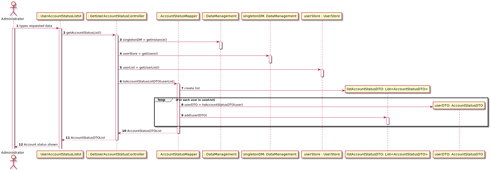

#### [Return Home](/docs/README.md)
# US024 - Get a list of all user accounts and their status
=======================================

## **1.Requirements Engineering**

### **1.1. User Story Description**

As Administrator, I want to get a list all user accounts and their status

### **1.2. Customer Specifications and Clarifications** 
    
**From the specifications document:**

- All user accounts will have a status that will specify if the account is active or inactive. 
- When the user account is registered the default status is inactive.
- After an user account is created an automatic link is sent to the user's email so he/she can activate its account status.
- The administrator has the ability to activate or inactivate the status of any user account.

**From the client clarifications:**

> **Question:** *A lista que queremos retornar, deverá conter somente o elemento identificativo do utilizador (email) e o seu estado (ativo/desativo)?*
>
> **Answer:** *Como ainda não se vai mostrar nada (não temos UI), não sabemos exatamente o que é preciso. Email e estado parecem-me bem. Mais tarde, pode vir a precisar de mais coisas...*
    

**From Group Discussion:**
- After meeting with the Product Owner and meeting in group we achieved the following conclusions:
- The data that will be 'presented' to the user will only have two informations: the user's email and its status (active/inactive). 
- Later on we might need to add more information to this list.
    

### **1.3. Acceptance Criteria**

* **AC1:** The presented list must include atleast: the user's email and its account status.
* **AC2:** Only the Administrator has the ability to see a list of all user accounts and their status.

### **1.4. Found out Dependencies**

* There is a dependency to the [**US002** - *"As Non-Registered User, I want to activate a just registered user account."*](/docs/sprint-A/US002). In this US the user can activate its own account.
* There is also a dependency to the [**US025**  *"As Administrator, I want to inactivate a user account"*](/docs/sprint-C/US025). The administrator can inactivate a user account.
* There is also a dependency to the [**US026**  *"As Administrator, I want to activate a user account"*](/docs/sprint-C/US026). The administrator can activate a user account.

### **1.5. Input and Output Data**

#### **Output Data:**

- User email.
- User status.

### **1.6. System Sequence Diagram (SSD)**

### 1.7 Other Relevant Remarks
n/a

## 2. OO Analysis

### 2.1 Business Rules

The Data Transfer Object that will be returned should contain the following information:

| **_Value Objects_**         | **_Business Rules_**                                                                                                                                 |
| :-------------------------- | :------------------------------------------------------------------------------------------------------------------------------------------------------ |
| **Email**             | Must follow the standard rules for an email.                                                                   |
| **isActivated**                 | True if activated, false if not.|

### 2.2. Relevant Domain Model Excerpt 

The following is the domain model excerpt considered relevant to this US.

### 2.3. Other Remarks
n/a

## 3. Design - User Story Realization 

## 3.1. Sequence Diagram (SD)

The administrator will the request a list of all user account and its status. When the request is send, the controller will ask for the user list, so the mapper can convert it to a list of dtos, presenting only the required information: user email and account status. This mapper will loop through the system's user list and convert each user to a dto and add it to a list. To conclude, this list will go through every layer untill it is presented in the UI.

## 3.2. Class Diagram (CD)

## 3.3. Use Case Diagram (CD)

### 3.4. Applied designs
Throughout the project we implemented GRASP and SOLID principles.

Firstly, the controller has the responsibility to instantiate the DataManagement Class, that is the information expert regarding all stores. Then the controller get access to the userlist from userstore. After it, the controller delegates the responsability of converting the user list in a list of dtos to the account status mapper class. The method toAccountStatusListDTO will receive a userlist and convert it to a list of dtos.

# 4. Tests
**Unit test 1:** Verify when there are no users in the system, the methods return an empty list.

**Unit test 2:** Verify when there is a single user in the system, the methods return a list with that single user as account status dto.

**Unit test 3:** Verify when there are several users in the system, the methods return a list with several users as account status dto.

# 5. Construction (Implementation)

## Class CreateTaskController
    public ArrayList<AccountStatusDTO> getUserAccountStatus() {

        UserStore userStore = singletonDM.getUsers();
        List<User> userList = userStore.getUserList();

        return AccountStatusMapper.toAccountStatusListDTO(userList);
    }

## DTO and Mapper

### Class AccountStatusDTO

    public class AccountStatusDTO {

    public final String email;
    public final boolean isActivated;

    public AccountStatusDTO(String email, boolean isActivated) {
        this.email = email;
        this.isActivated = isActivated;
    }

### Class Account Status Mapper

    public class AccountStatusMapper {

    public static ArrayList<AccountStatusDTO> toAccountStatusListDTO(List<User> userList) {
        ArrayList accountStatusDTOList = new ArrayList<AccountStatusDTO>();
        for (User user : userList) {
            AccountStatusDTO userDTO = toAccountStatusDTO(user);
            accountStatusDTOList.add(userDTO);
        }
        return accountStatusDTOList;
    }

    public static AccountStatusDTO toAccountStatusDTO(User selectedUser) {
        return new AccountStatusDTO(selectedUser.getEmail(), selectedUser.getAccountStatus());
    }

}

# 6. Integration and Demo

# 7. Observations

n/a

