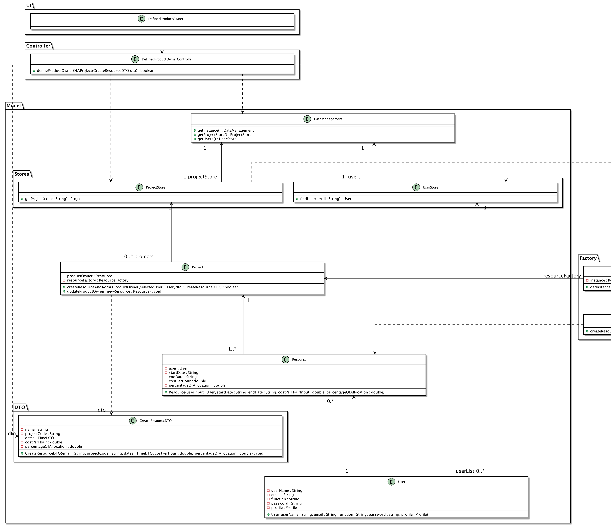

#### [Return Home](/docs/README.md)

# US027 - Define the Product Owner of a project

# 1. Requirements

### **1.1. User Story Description**

As Director, I want to define the PO of a project.

### **1.2. Client Notes and Specifications**

During the meetings with the product owner and through the analysis of the specifications, some notes/observations were
recorded:

- A director must be able to create resources indicating:
- the user's email (unique in the system);
- the project code (unique in the system);
- the creation dates of resource;
- the cost per hour;
- the percentage of allocation.

**From the client clarifications:**

> **Question:** *Conforme o enunciado do projeto, o PO, bem como os outros membros da equipa, não devem mudar durante um ‘sprint’. No entanto, na última ‘sprint’ review foi apontado pelos POs que isto poderia ser muito restritivo, pois devido a alguma situação imprevista, pode ser necessário substituir um recurso a qualquer momento. Para o nosso projeto, e especificamente para a US27, a data de início de funções de um PO pode ser qualquer uma, depois da data de início do projeto, ou deve necessariamente coincidir com a data de início de um ‘sprint’?*
>
> **Answer:** "O PO pode ser trocado em qualquer altura." (cf. BitBucket, SWitCH 2021-2022 ISEP, Project_Wiki)

**From Group Discussion:**

- After meeting with the Product Owner and meeting in group we achieved the following conclusions:
- the **Product Owner** can be defined at any time in the project and changed whenever necessary. We don't need to keep
  history for now.
- Should be implemented a Data Transfer Object (Design Pattern) to carrie the input data between UI and Domain layers.

### **1.3. Acceptance Criteria**

* **AC1:** A director must be able to define a PO of a Project.
* **AC2:** All attributes must be filled.
* **AC3:** definition of product owner is not possible when resource is already a team member in that project.
* **AC4:** definition of product owner is not possible when resource is already a scrum master in that project.
* **AC5:** definition of product owner is not possible when resource is already a project manager in that project.

### **1.4. Dependencies with other User Stories**

This User Story is not dependent on any User Story.

### **1.5. Input and Output Data**

#### **Input Data:**

* **Typed data:**
    - String startDate;
    - String endDate;
    - Double costPerHour;
    - Double percentageOfAllocation.

* **Selected data:**
    - Selected Project from a list of Projects;
    - Selected User from a list of Users to choose a Resource;

#### **Output Data:**

- Created Resource and PO is defined in a project.
- Boolean: if the Product Owner is successfully defined, returns **true**; otherwise, returns **false**.

### **1.6. System Sequence Diagram**

The System Sequence Diagram (SSD) tracks how the functions and the use case functions are performed inside the system. 
The sequence diagram of the system idealized for this US is presented below.

# 2. Analyze

### 2.1. Business Rules

The Resource and it's value objects have the following business rules:

| **_Value Objects_**          | **_Business Rules_**                                           |
|:-----------------------------|:---------------------------------------------------------------|
| **Email**                    | Mandatory, must follow the standard rules for an email.        |
| **Project Code**             | Mandatory, must follow the standard rules for an project code. | 
| **Dates**                    | Mandatory, starDate must be before endDate.                    | 
| **Cost Per Hour**            | Mandatory, must be positive in a range from 1 to 9999.99. .    | 
| **Percentage Of Allocation** | Mandatory, must be positive in a range from 0 to 100 .         | 

### 2.2. Excerpt of the Relevant Domain Model

The following is the domain model excerpt considered relevant to this US.

# 3. Design

### 3.1. Sequence Diagram

The purpose of this user story is to define the product owner of a project. After a close look at the
SD, we can observe the flow of this operation. It starts with the user input: a string that is equivalent to the project code, another string that is equivalent to the user's email, the dates (start and end), a double cost per hour and, finally, another double allocation percentage.
The controller uses this information to access the desired project and the desired user by going through the
Data pointing to the Project and User Store where they are stored, respectively. After that, inside the Project class, converting the primitive data dto into objects
there is a method that says there is Resource Factory Implementation to actually create the desired resources. Finally, after the object creation, the Resource is set as the Product Owner for this project.

### 3.2. Class Diagram

Bellow is the class diagram, that describes the attributes and operations of a class and also the constraints imposed on
the system.

### 3.3. Use-Case Diagram

This User Story represents the case where a User with the role of Director wants to define a Product Owner of a project,
as shown bellow.

### 3.4. Design Patterns

For the past few weeks , many new concepts and design patterns were introduced. In order to improve the reliability and
control of our project.  
By restricting the instantiation of the class Data Management (the class that knows the system globally), we've been implementing the Singleton pattern. 
Besides, that, we've also been trying to use and implement some GRASP and SOLID principals. 
On this note, the controllers were also implemented, and given the job of delegating responsibilities throughout the system. 
The UserStore and ProjectStore act as a pure fabrication class and serve to achieve balance between low coupling and high cohesion in our project, when the standard information expert does not. 
Thus, I consider that the Project is the information expert as it knows all the information about the Product Owner and all ohter Resources. 
Although, he knows the Resources, the Project delegates to the Factory (another pattern implemented) the responsibility to create the object,
Therefore, the Projects sends the message to the ResourceFactoryImplemantion to create the object, using the principle ***Tell, Don't Ask***.
So, the ResourceFactoryImplementation is considered the creator, where it does so without exposing the creation logic to the client, referring to the newly created object using an interface. 
Once created, the controller receives the success case of the operation and "translates" it to the UI side.

# 4. Tests
Test scenarios created for this US.

***CLASS PROJECT***

**TEST 1:** Definition of Product Owner is Sucessfully defined.

**TEST 2:** Definition of Product Owner failed because Product Owner already is team member.

**TEST 3:** Definition of Product Owner failed because Product Owner already is project manager.

**TEST 4:** Definition of Product Owner failed because Product Owner already is scrum master.

**TEST 5:** Definition of Product Owner failed because empty team.

# 5. Construction (Implementation)

>####Class **DefinedProductOwnerController**
        public boolean defineProductOwnerOfAProject(CreateResourceDTO dto)
        throws ParseException {

        ProjectStore projects = singletonDM.getProjectStore();
        Project project = projects.getProject(dto.projectCodeDto);
        UserStore users = singletonDM.getUsers();
        User selectedUser = users.findUser(dto.emailDto); 

        return project.createResourceAndAddAsProductOwner(selectedUser, dto);
    } }

>####Class **Resource**

**Constructor**

        public Resource(User userInput,
                    String startDate,
                    String endDate,
                    double costPerHourInput,
                    double percentageOfAllocationInput) throws ParseException {
        this.user = userInput;
        this.resourceDates = new Time(startDate, endDate);
        this.costPerHour =
                new ResourceCostPerHour(costPerHourInput);
        this.percentageOfAllocation =
                new ResourcePercentageOfAllocation(percentageOfAllocationInput);
    }

>####Class **Project**
 **Method for Creating an adding a product owner to a Project**

      public boolean createResourceAndAddAsProductOwner(final User selectedUser,
                final CreateResourceDTO dto) throws ParseException {

        String startDate = dto.datesDto.startDate;
        String endDate = dto.datesDto.endDate;
        double costPerHour = dto.costPerHourDto;
        double percentageOfAllocation = dto.percentageOfAllocationDto;

        Resource newResource = this.resourceFactory.createResource(
                selectedUser, startDate, endDate, costPerHour, percentageOfAllocation);

        if (isTeamMember(newResource) || isProjectManager(newResource) || isScrumMaster(newResource)) {
            return false;
        }

        this.updateProductOwner(newResource);
        return true;
    }

>####Class **Project**
**Secundary method to finish definition of product owner**

       public void updateProductOwner(final Resource productOwnerInput) {
        this.productOwner = productOwnerInput; 
}

