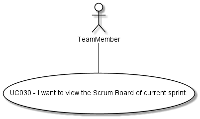

#### [Return Home](/docs/README.md)
# US030 - I want to view the Scrum Board of current sprint.
=======================================

## **1.Requirements Engineering**

### **1.1. User Story Description**

As Team Member, I want to view the Scrum Board of current sprint.

### **1.2. Customer Specifications and Clarifications** 
    
**From the specifications document:**

- User Story requirements not specified in the specfications documents.

**From the client clarifications:**

> **Question:** * O scrum board é uma listagem das us no sprint backlog de acordo com o estado?*
>
> **Answer:** *" Acaba por ser algo do género."* (cf. Microsoft Teams, SWitCH 2021-2022 ISEP, Canal Project)

> 
> **Question:** * Que informação deve ser passada ao team member? Estado e descrição das tarefas/user stories são suficientes? É necessário outro tipo de informação? (G5, 01/02)?*
>
> **Answer:** *" Se as tarefas e user stories tiverem responsáveis, pode fazer sentido que também seja disponibilizada essa informação."* (cf. https://bitbucket.org/switch-2021/project_wiki/wiki/User%20Stories)

**From Group Discussion:**

After meeting with the Product Owner and meeting in group we achieved the following conclusions:

  - The scrum board of a sprint should have the User Stories and Tasks, grouped by their status. Therefore, the ScrumBoard 
consists of eight lists, each one according to the current status of the User Stories or Tasks.
  - The scrum board uses lists data transfer objects. These data transfer objects should have the 
snapshot with the essencial information about the current state of the user stories and  tasks in the sprint.
  

### **1.3. Acceptance Criteria**

* **AC1:** A team member must be able to generate a ScumBoard of the current sprint in a project.
* **AC2:** The scrum board must have the user stories and tasks grouped in lists by status.
* **AC3:** The project code must follow the domain rules stabilished for the project code.
* **AC4:** The user email must follow the domain rules estabilished for an email.
* **AC5:** The project code must correspond with a project present in the project store.
* **AC6:** The user email must correspond with a team member in the selected project.
* **AC7:** A sprint must be currently running in the project.
* **AC8:** If the current sprint doesn't have user stories or tasks associated, a scrum board with empty lists is returned.
* **AC9:** If the requirements described in AC5, AC6, AC6 and AC7 are not met, a scrum board with empty lists is returned.

### **1.4. Found out Dependencies**

* There is a dependency with [**US034** - *"As Project Member, I want to update the status (i.e.: the Scrum Board category) 
of a user story in the scope of the current sprint backlog"*](/docs/sprint-C/US034). If the status of a user story is changed,
the user story is inserted into a list of the scrum board according to its new status.

### **1.5. Input and Output Data**

#### **Input Data:**

* **Typed data:**
  - User email;
  - Project code;

* **Selected data:**
  - Selected project from a list of projects;
  - Current Sprint from the project sprint list of the project.

#### **Output Data:**

- Scrum board of the current Sprint of the selected Project.

### **1.6. System Sequence Diagram (SSD)**

### 1.7 Other Relevant Remarks
n/a

## 2. OO Analysis

### 2.1. Business Rules
The Scrum Board generation and it's value objects have the following business rules:

| **_Value Objects_**       | **_Business Rules_**                                              |
|:--------------------------|:------------------------------------------------------------------|
| **ProjectCode**           | Alphanumerical must be within 0 and 5 characters.                 |
| **Email**                 | Must follow the standard rules for an email. | 

### 2.2. Relevant Domain Model Excerpt 
The following is the domain model excerpt considered relevant to this US.

## 3. Design - User Story Realization 

## 3.1. Sequence Diagram (SD)
This user story starts with a team member wanting to get the Scrum Board of the current Sprint of a Project. To do this
the team member must indicate the project, identified by the project code, and the User which will be identified by his/her email.
The project code will be used to search in the ProjectStore the wanted Project and the email to check if the User is a Resource of said 
Project included in the Project Team. If these requirements are met, a Scrum Board of the running Sprint will be generated 
and returned to the User.

Detailed view of the interaction use realting to the scrumBoardDTO creation.

## 3.2. Class Diagram (CD)

Detailed view of the ScrumBoardDTO package

## 3.3. Use-Case Diagram
In this Project most User Stories represent a unique interaction between one or more actors and the system.
This User Story represents the case where a User with the role of Team Member wants to get the scrum board of the current sprint in a project, as shown bellow.

# 4. Tests
Test scenarios created for this US.

**TEST 1:** Creation of scrum board fails due to null inputs in the controller (user email and project code).

**TEST 2:** Creation of scrum board fails due to input project code does not respect the business rules established for the project code.

**TEST 3:** Creation of scrum board fails due to input user email does not respect the business rules established for the user email.

**TEST 4:** Creation of scrum board fails due to input project code not corresponding to a project in the project store.

**TEST 5:** Creation of scrum board fails due to input user email not corresponding to a team member in the selected project.

**TEST 6:** Creation of scrum board fails due to not existing a running sprint in the selected project.

**TEST 7:** Creation of scrum board is successful and a scrum board with lists of user stories and tasks, grouped by their current status, is returned.

# 5. Construction (Implementation)

# 6. Integration and Demo

# 7. Observations

n/a

