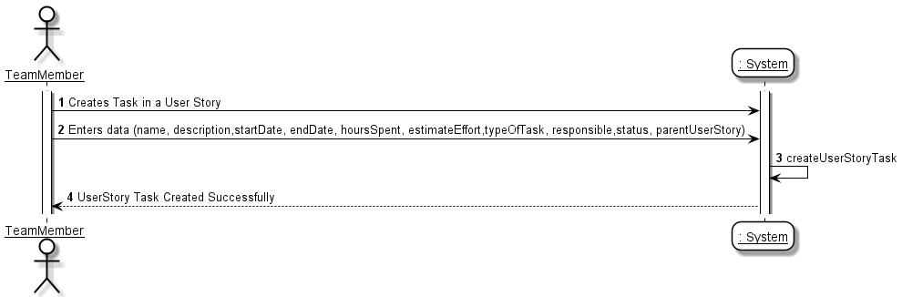
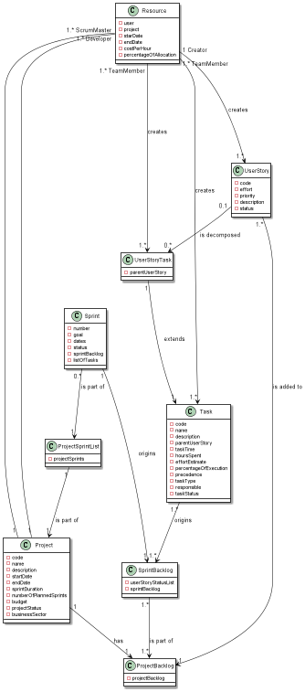
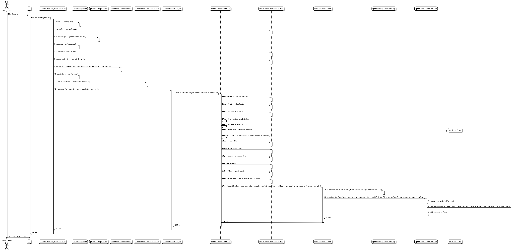
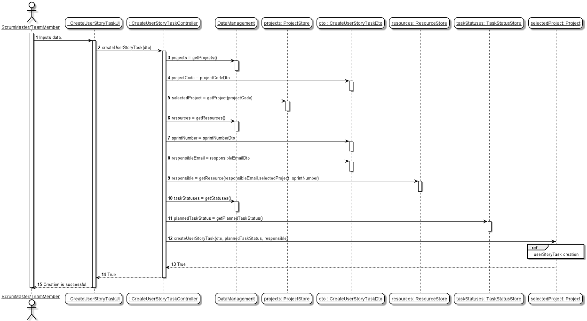
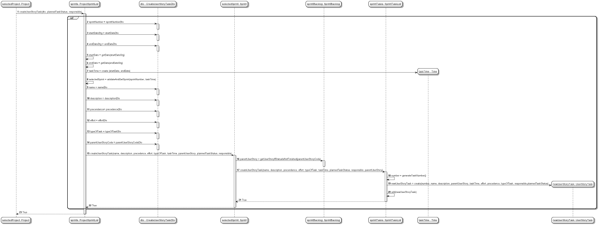
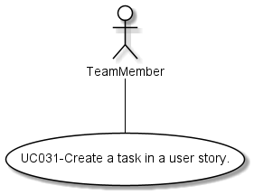

#### [Return Home](/docs/README.md)
# US031 - Create a task in a user story.
=======================================

## **1.Requirements Engineering**

### **1.1. User Story Description**

As Team Member, I want to create a task in a user story.

### **1.2. Customer Specifications and Clarifications** 
    
**From the specifications document:**

- Each sprint has a "sprint backlog", i.e. the set of user stories that should be addressed during the sprint.
- A user story may include several tasks that have to be done for the user story to be completed.
- During the sprint, project team members register work done in these tasks.

   A task must have at least the following information:

     - Name of the task;
     - Description of the task;
     - User story;
     - Start Date;
     - End Date;
     - Hours spent (0 at the time it is created);
     - Effort estimate (start by having the initial estimate, but can be updated several times 
       throughout the project; uses Fibonacci series for duration in hours.);
     - Percentage of execution (0% if it has not yet started, up to 100% when it is completed;
       value calculated automatically based on the relationship between the hours spent and 
       the estimated effort);
     - Precedence (optional, list of tasks that must be completed before the start of the task);
     - Type of task (Meeting, Documentation, Design, Implementation, Testing, Deployment, ect.);
     - Task status (Planned / Running / Finished / Blocked);
     - Responsible (human resource responsible for the execution of the task).

- There may be other technical (e.g. deployment, etc.) or general/independent tasks (e.g.meetings, etc.) which may happen once or periodically. For example, there may be user stories and non-functional requirements related to system deployment, but the actual deployment takes place multiple times along the project and there may be an effort related to it. As such, there may be a task in each sprint related to deployment (e.g. changes in configuration due to implemented user  stories, etc.). Meetings also have an effort and many have no relation to user stories (e.g. sprint review, sprint retrospective, etc.).
- The creation of tasks is done by the team members.

**From the client clarifications:**

> **Question:** *O esforço da «task» deve estar relacionado com o esforço de uma «user story»? Ou seja, devemos validar que a soma do esforço das «tasks» relativas a uma «user story» não devem ultrapassar o esforço estimado da respectiva «user story»?*
>
> **Answer:** *"Não. Não se pode confundir estimativas com o report da realidade."* (cf. Microsoft Teams, SWitCH 2021-2022 ISEP, Canal Project)
    

> **Question:** *O tipo de «task» deve ser selecionado a partir de uma lista (ex: Meeting, Documentation, Design, Implementation, Testing, Deployment,...)? Ou é uma descrição introduzida pelo ator?*
>
> **Answer:** *"Poderá ser interessante haver uma padronização por projeto, mas ainda não há user stories nesse sentido."* (cf. Microsoft Teams, SWitCH 2021-2022 ISEP, Canal Project)

> **Question:** *Qual é a diferença entre os estados ~~«Blocked» e «Finished» de uma «task»?*
>
> **Answer:** *"Onde foi buscar isso?"* (cf. Microsoft~~ Teams, SWitCH 2021-2022 ISEP, Canal Project)

> **Question:** *No enunciado da US31 ("As Team Member, I want to create a task in a user story"), sub-entende-se que uma «task» é criada como atributo de uma «user story». No entanto, um dos atributos de uma «task» é uma «user story». Na nossa interpretação, um «sprint» poderá ter uma lista de «tasks», que podem ou não estar relacionadas a «user stories».*
>
> **Answer:** *"Subentender é perigoso. Sinceramente, não estou a ver uma task como um atributo de uma user story."* (cf. Microsoft Teams, SWitCH 2021-2022 ISEP, Canal Project)

> **Question:** *Relativamente à questão relacionada com os estados de uma «task» (blocked / finished), a dúvida surgiu na linha 27, da página 4, da versão 3 do enunciado - (A task must have) "Task status (Planned / Running / Finished / Blocked)".*
>
> **Answer:** *"Normalmente, de blocked pode passar a running. Eu diria que fazia sentido considerar ainda o estado "cancelled", mas ainda temos tempo para abordar esse assunto."* (cf. Microsoft Teams, SWitCH 2021-2022 ISEP, Canal Project)

**From Group Discussion:**

  - After meeting with the Product Owner and meeting in group we achieved the following conclusions:
  - A user story is always an attribute of a task, when not on the scope of a user story it's considered null.
  - The effort of a task is not related with the effort of a user story.
  - For now, the type of task will be a description, and not a pre-established list of tasks from which a user selects the
    more convenient one.
  - A task may have five differente status: *Planned*, *Running*, *Blocked*, *Finished* and *Canceled*.
  - A *Blocked* task may change to the *Running* status afterwards but it isn't considered *Finished*.
  - *Finished* is the last possible status, indicating a task has ended successfully.
  - In order to ease for the user the creation of the task only when a project is selected wrongfully the task isn't
    created. Therefore, we'll try to return the less errors possible to the user. In most cases the attributes will assume
    the closer possible insertion. For example, if a name of a task doesn't follow the rules of having less than 50
    letters the system will automatically reduce to 50. Also, if it has special characters the system will not assume
    them, only the letters inserted.
  - Each Project owns his Project Sprint List, wich is composed by Sprints; each Sprint has a Sprint Task List, composed by Tasks.
  - Should be implemented a Data Transfer Object (Design Pattern) to carrie the input data between UI and Domain layers. 

### **1.3. Acceptance Criteria**

* **AC1:** A team member must be able to create a task.
* **AC2:** All attributes must be filled, except for the precedence which is optional.
* **AC3:** The input name for the task must be between 0 and 50 letters, if there's a mistake and the lenght is above
  the maximum (50) it automatically stays with 50 characters. If the name inserted has special characters they're
  automatically taken from the name.
* **AC4:** At time of creation the Hours Spent with the task must be 0.
* **AC5:** Percentage of execution must be set between 0% up to 100%, when created the task it is given as default 0.
* **AC6:** A team member must have the possibility of assigning a task to a User Story.
* **AC7:** User must be able to associate himself/herself or other resource to a created task.
* **AC8:** The user email (responsible) must follow the domain rules established for an email.
* **AC9:** The effort estimate must follow the domain rules established for an effort.
* **AC10:** Precedence (list of tasks that must be completed before the start of the task) is opcional. By default, is empty.
* **AC11:** It must be possible to update the status of a task.
* **AC12:** Task time should be between the start date and end date of the Sprint wich the task belongs.
* **AC13:** In a User Story there may be different tasks associated.
* **AC14:** It must be possible to create more than one task in a User Story.
* **AC15:** The number of tasks in a Sprint must be numbered, it's autoincrement.
* **AC16:** Even though all attributes (except for the precedence) must be filled in, if the user forgets to insert any
  attribute apart from the project the task is always created without an error.
* **AC17:** The type of task is inserted just like a description.
* **AC18:** The user email (responsible) must correspond with a resource in the selected project and sprint.
* **AC19:** The status of the sprint (related to task) cannot be "Finished".

### **1.4. Found out Dependencies**

* There is a dependency to the [**US032** - *"As SM/Team Member, I want to create task outside the scope of a user
  story"*](/docs/sprint-C/US032). Because both User Stories have the objective of creating a task. The difference
  between them is centered in whether a task is related or not to a User Story. Therefore User Story Task is a Subclass 
  which inherits attributes and methods from Task (Superclass). 
  User Story Tasks are also added to Sprint Task List, as any instance of Task.

* There is also a dependency to the [**US033** as its objective is to *"As SM/Team Member, I want to register work done
  on a Task"*](/docs/sprint-C/US033). In order to register the work done it depends on the creation of a task.

### **1.5. Input and Output Data**

#### **Input Data:**

* **Typed data:**
    - String name;
    - String description;
    - String startDate;
    - String endDate;
    - List<Integer> precedence;
    - String responsibleEmail;
    - String typeOfTask;
    - String projectCode;
    - int sprintNumber;
    - int effortEstimated.
    - String parentUserStoryCode.

* **Selected data:**
  - Selected Project from a list of Projects;
  - Selected User from a list of Users to discover a Resource;
  - Selected Resource from a list of Resources to know who wants to create and be assigned a task;
  - Selected Sprint from a list of Sprints;
  - Selected User Story from a list of User Stories to which the task was created for.

#### **Output Data:**

- Created UserStoryTask.
- Boolean: if the UserStorytask is successfully created, returns **true**; otherwise, returns **false**.

### **1.6. System Sequence Diagram (SSD)**

### 1.7 Other Relevant Remarks
n/a

## 2. OO Analysis

### 2.1. Business Rules
The task creation and it's value objects have the following business rules:

| **_Value Objects_**         | **_Business Rules_**                                                                                                                                 |
| :-------------------------- | :------------------------------------------------------------------------------------------------------------------------------------------------------ |
| **Name**             | Mandatory, must be between 1 and 50 letters, special characters are not accepted. If user inserts more than 50 letters the system assumes automatically 50 elements. The same thing happens with special characters, name is created only with the letters inserted.                                                                                             |
| **Description**                 | Mandatory, alphanumerical and must be within 0 to 150 characters.
| **StartDate and endDate**                 | Mandatory, starDate must be before endDate.
| **HoursSpent**                 | At the time of creation is automatically 0.
| **EffortEstimate**                 | Mandatory, starts with an estimated value, but it can be updated several times. Input must be part of the fibonnaci values (0, 1, 2, 3, 5, 8, 13, 21, 34).
| **PercentageOfExecution**                 |Automatically assumes percentage 0%. It goes up to 100% when it is completed. Value calculated automatically based on the relationship between the hours spent and the estimated effort.
| **PrecedenceList**                 |Optional, list of tasks that must be completed before the start of the task.
| **TypeOfTask**                 |Mandatory, just like a description. User inserts a name for it.
| **Responsible**                 |Mandatory, user must insert the resource responsible for the task. Although, if resource isn't inserted correctly task is still created.
| **Status**                 |Mandatory,it starts with index 0, and as a String. Input must be between 4 and 50 characters. If team member inserts wrongly the status it is correcter automatically.

### 2.2. Relevant Domain Model Excerpt 
The following is the domain model excerpt considered relevant to this US.

## 3. Design - User Story Realization 

## 3.1. Sequence Diagram (SD)
This user story starts with a team member wanting to create a task outside the scope of a User Story, for this to be possible they must indicate the project of the task, identified by the project code, the sprint of the task, identified by the sprint number, the User which will be identified by his/her email, and with that information indicate if that User is a Resource of the selected project, making him/her able to create the task.
These parameters are needed for the identification of where to create the task and who will do it.
Having done that we add the task parameters in order to create it. This new task will have the following attributes inserted by the team member (only the project and UserStory are mandatory for the task to be created in a User Story, if the user doesn't insert the other data the task is still created).

Bellow is also added the Sequence Diagram of this UserStory with references for better understanding and viewing.

Second part of Sequence Diagram - Ref:

## 3.2. Class Diagram (CD)
Bellow is the class diagram, that describes the attributes and operations of a class and also the constraints imposed on the system.

## 3.3. Use-Case Diagram
In this Project most User Stories represent an unique interaction between one or more actors and the system.
This User Story represents the case where a User with the role of Team Member wants to create a task in a User Story, as shown bellow.

# 4. Tests
Test scenarios created for this US.
We only represent the type of tests made for this User Story because for the creation of tests we have to create a long list of objects.

**TEST 1:** Creation of USTask is successful even though it doesn't have precedence list of tasks.

**TEST 2:** Creation of USTask is successful even though it doesn't have precedence list of tasks and valid Parent User Story.

**TEST 3:** Creation of USTask is successful having a precedence list with two valid tasks.

**TEST 4:** Creation of USTask is successful having a precedence list with one valid task.

**TEST 5:** Creation of USTask is successful even though it doesn't have a valid resource associated.

**TEST 6:** Creation of USTask is successful even though the selected User Story is invalid because its status is finished.

**TEST 7:** Creation of USTask Fails because Project is Invalid.

**TEST 8:** Creation of USTask Fails because Sprint is Invalid.

**TEST 9:** Creation of USTask Fails because Sprint Status is Done.

# 5. Construction (Implementation)
##Class CreateTaskController
    public boolean createTask(final CreateTaskDto dto) {
      try {
      Project selectedProject = getProject(dto);
      Resource responsible = getResource(dto,selectedProject);
      Status plannedTaskStatus = getPlannedTaskStatus();
      return selectedProject.createTask(dto, plannedTaskStatus,
      responsible);
        } catch (NullPointerException | ParseException exception) {
          return false;
      }
    }

## Class Task

**Constructor**

    public Task(final int numberInput,
      final Name nameInput,
      final Description descriptionInput,
      final UserStory parentUserStoryInput,
      final Time taskTimeInput,
      final EffortEstimate effortEstimateInput,
      final Set<Task> precedenceListInput,
      final String taskTypeInput,
      final Resource responsibleInput,
      final Status statusOfTaskInput) {
      this.number = numberInput;
      this.name = nameInput;
      this.description = descriptionInput;
      this.parentUserStory = parentUserStoryInput;
      this.taskTime = taskTimeInput;
      this.effortEstimate = effortEstimateInput;
      this.precedenceList = precedenceListInput;
      this.typeOfTask = taskTypeInput;
      this.responsible = responsibleInput;
      this.statusOfTask = statusOfTaskInput;
    }

## Class SprintTaskList
  **Method for Creating an adding a task to a Sprint List**

    public boolean createTask(final String name,
      final String description,
      final List<Integer> precendenceList,
      final int effortEstimateInput,
      final String typeOfTask,
      final Time taskTime,
      final Status plannedTaskStatus,
      final Resource responsible,
      final UserStory selectedUS) {

        int taskNumber = this.generateTaskNumber();
        Name taskName = new Name(name);
        Description taskDescription =
                new Description(description);
        EffortEstimate effortEstimate = new EffortEstimate(effortEstimateInput);
        Set<Task> precedenceTaskListWithUserStory = getPrecendenceTaskList(precendenceList);

        Task newTask = new Task(taskNumber, taskName, taskDescription,
                selectedUS, taskTime, effortEstimate, precedenceTaskListWithUserStory,
                typeOfTask, responsible, plannedTaskStatus);

        return tasks.add(newTask);
    }

  **Method for getting the precedence list of task in a Sprint List**

    protected Set<Task> getPrecendenceTaskList(final List<Integer> precedenceListInput) {
      if (precedenceListInput == null) {
      return null;
      }
        Set<Task> precedenceList = new HashSet<>();
        for (Integer eachNumber : precedenceListInput) {
            Task eachTask = getTaskForEachNumber(eachNumber);
            if (eachTask != null) {
                precedenceList.add(eachTask);
            }
        }

        return precedenceList;
    }

## Class TaskStatusStore

**Method for Default List of Task Statuses**
    
    private void defaultTaskStatuses() {
      createTaskStatus("Planned");
      createTaskStatus("Running");
      createTaskStatus("Blocked");
      createTaskStatus("Finished");
    }

**Method for creating Task Statuses**

    private void createTaskStatus(final String description) {
      final Status newStatus =
      new Status(description);
      taskStatuses.add(newStatus);
    }

**Method for getting default Task Statuses**

    public Status getTaskStatus(final String pretendedStatusDescription) {
    Status pretendedStatus = new Status(pretendedStatusDescription);

        for (Status eachStatus : taskStatuses) {
            if (eachStatus.equals(pretendedStatus)) {
                return eachStatus;
            }
        }

        taskStatuses.add(pretendedStatus);
        return pretendedStatus;
    }

## DTO
### Class TaskDTO

   	public class TaskDTO {

    public final int taskNumber;
    public final String taskName;
    public final String taskDescription;
    public final String parentUserStoryCode;
    public final Integer effortEstimate;
    public final String taskType;
    public final String responsibleResource;
    public final String statusOfTask;

      public TaskDTO(int tasknumber, String taskName, String taskDescription
            , String parentUserStoryCode, Integer effortEstimate, String taskType
            , String responsibleResource, String statusOfTask) {
        this.taskNumber = tasknumber;
        this.taskName = taskName;
        this.taskDescription = taskDescription;
        this.parentUserStoryCode = parentUserStoryCode;
        this.effortEstimate = effortEstimate;
        this.taskType = taskType;
        this.responsibleResource = responsibleResource;
        this.statusOfTask = statusOfTask;
        }
    }

# 6. Observations

n/a

