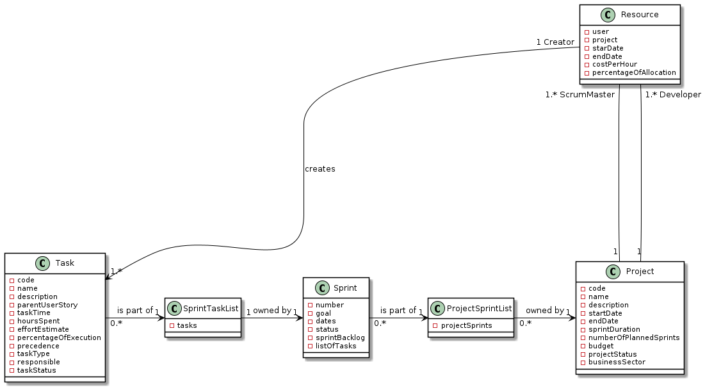

#### [Return Home](/docs/README.md)
# US032 - Create a task outside the scope of a user story.

## **1.Requirements Engineering**

### **1.1. User Story Description**

As SM/Team Member, I want to create task outside the scope of a user story.

### **1.2. Customer Specifications and Clarifications** 

**From the specifications document:**

   A task must have at least the following information:

     - Name of the task;
     - Description of the task;
     - User story;
     - Start Date;
     - End Date;
     - Hours spent (0 at the time it is created);
     - Effort estimate (start by having the initial estimate, but can be updated several times 
       throughout the project; uses Fibonacci series for duration in hours.);
     - Percentage of execution (0% if it has not yet started, up to 100% when it is completed;
       value calculated automatically based on the relationship between the hours spent and 
       the estimated effort);
     - Precedence (optional, list of tasks that must be completed before the start of the task);
     - Type of task (Meeting, Documentation, Design, Implementation, Testing, Deployment, ect.);
     - Task status (Planned / Running / Finished / Blocked);
     - Responsible (human resource responsible for the execution of the task).

There may be other technical (e.g. deployment, etc.) or general/independent tasks (e.g.meetings, etc.) which may happen once or periodically. For example, there may be user stories and non-functional requirements related to system deployment, but the actual deployment takes place multiple times along the project and there may be an effort related to it. As such, there may be a task in each sprint related to deployment (e.g. changes in configuration due to implemented user  stories, etc.). Meetings also have an effort and many have no relation to user stories (e.g. sprint review, sprint retrospective, etc.).

The creation of tasks is done by the team members.

**From the client clarifications:**

> **Question:** *Should the type of task be selected from a list (eg Meeting, Documentation, Design, Implementation, Testing, Deployment,...)? Or is it a description inserted by the actor?*
>
> **Answer:** *"It might be interesting to have a standardization by project, but there are still no user stories for that."* (cf. Microsoft Teams, SWitCH 2021-2022 ISEP, Project)

> **Question:** *What is the difference between «Blocked» and «Finished» statuses of a «task»?*
>
> **Answer:** *" Usually, task status can change from blocked to running. I would say it made sense to still consider the "cancelled" state, but we still have time to do that."* (cf. Microsoft Teams, SWitCH 2021-2022 ISEP, Project)

**From Group Discussion:**

  - Each Project owns his Project Sprint List, wich is composed by Sprints; each Sprint has a Sprint Task List, composed by Tasks.
  - A Task may or not be associated with a user story (Task / User Story Task); nevertheless, it must be kept in the same Sprint Task List. Null fields must be avoided.
  - Should be implemented a Data Transfer Object (Design Pattern) to carrie the input data between UI and Domain layers.
  - The output from Domain do UI should be boolean: if task is created, returns true; otherwise, returns false.

### **1.3. Acceptance Criteria**

* **AC1:** A team member must be able to create a task.
* **AC2:** Task name must follow the domain rules established for the name.
* **AC3:** Task description must follow the domain rules established for the description.
* **AC4:** Task time must follow the domain rules established for the time. 
* **AC5:** The project code must follow the domain rules established for the project code.
* **AC6:** The user email (responsible) must follow the domain rules established for an email.
* **AC7:** The effort estimate must follow the domain rules established for an effort.
* **AC8:** Precedence (list of tasks that must be completed before the start of the task) is opcional. By default, is empty.
* **AC9:** Task time should be between the start date and end date of the Sprint wich the task belongs.
* **AC10:** At creation time, the hours spent with the task must be 0.
* **AC11:** At creation time, percentage of execution is given as default 0.
* **AC12:** User must be able to associate himself/herself or other resource to a created task.
* **AC13:** It must be possible to update the status of a task.
* **AC14:** The project code must correspond with a project present in the project store.
* **AC15:** The user email (responsible) must correspond with a resource in the selected project and sprint.
* **AC16:** The status of the sprint (related to task) cannot be "Finished".

### **1.4. Found out Dependencies**

* There is a dependency to [**US031** - *"As Team Member, I want to create a task in a user story"*](/docs/sprint-C/US031). User Story Task is a Subclass that inherits attributes and methods from Task (Superclass). User Story Tasks are also added to Sprint Task List, as any instance of Task.

### **1.5. Input and Output Data**

#### **Input Data:**

* **Typed data:**
  - String name;
  - String description;
  - String startDate;
  - String endDate;
  - List<Integer> precedence;
  - String responsibleEmail;
  - String typeOfTask;
  - String projectCode;
  - int sprintNumber;
  - int effortEstimated.

#### **Output Data:**

- Boolean: if the task is successfully created, returns **true**; otherwise, returns **false**.

### **1.6. System Sequence Diagram (SSD)**

### 1.7 Other Relevant Remarks
n/a

## 2. OO Analysis

### 2.1. Business Rules 
The task creation and it's value objects have the following business rules:

| **_Value Objects_**         | **_Business Rules_**                                                                                                                                 |
| :-------------------------- | :------------------------------------------------------------------------------------------------------------------------------------------------------ |
| **Name**             | Alphanumerical between 0 and 50 characters.                                                                 |
| **Description**                 | Text length between 0 and 150 characters. |
| **Time**    | Start Date equal or greater than task creation time. End date must be greater than start date |
| **EffortEstimate**  | Input number must be part of the fibonnaci values (0, 1, 2, 3, 5, 8, 13, 21, 34). |
| **ProjectCode**     | Alphanumerical with 5 characters.                            |
| **Email**           | Must follow the standard rules for an email.                 |

### 2.2. Relevant Domain Model Excerpt
Below is an excerpt of the domain model considered relevant for this US.

## 3. Design - User Story Realization 

## 3.1. Sequence Diagram (SD)
Bellow is the sequence diagram that describes how - and in what order - the objects works to reach the goal of the user story.

Bellow is also added the Sequence Diagram of this UserStory with references for better understanding and viewing.

Second part of Sequence Diagram - Ref:

## 3.2. Class Diagram (CD)

Bellow is the class diagram, that describes the attributes and operations of a class and also the constraints imposed on the system.

## 3.3. Use-Case Diagram 
This Use-Case Diagram represents a User with the role of Scrum Master / Team Member that want to create a task outside the scope of a User Story.

# 4. Tests

Test scenarios created for this US.
We only represent the type of tests made for this User Story because for the creation of tests we have to create a long list of objects.

**TEST 1:** Creation of Task is successful even though it doesn't have precedence list of tasks.

**TEST 2:** Creation of Task is successful even though it doesn't have a valid resource associated.

**TEST 3:** Creation of Task Fails because Project is Invalid.

**TEST 4:** Creation of Task Fails because Sprint is Invalid.

**TEST 5:** Creation of Task Fails because Sprint Status is Done.

# 5. Construction (Implementation)

## Class CreateTaskController

    	public boolean createTask(final CreateTaskDto dto) {
            try {
                Project selectedProject = getProject(dto);
                Resource responsible = getResource(dto,
                        selectedProject);
                Status plannedTaskStatus = getPlannedTaskStatus();
                return selectedProject.createTask(dto, plannedTaskStatus,
                        responsible);
            } catch (NullPointerException | ParseException exception) {
                return false;
            }
        }
        
        protected Project getProject(final CreateTaskDto dto) {
            ProjectStore projects = singletonDM.getProjectStore();
            String projectCode = dto.projectCodeDto;
            return projects.getProject(projectCode);
        }
        
        private Resource getResource(final CreateTaskDto dto,
                                     final Project selectedProject) {
            ResourceStore resources = singletonDM.getResources();
            int sprintNumber = dto.sprintNumberDto;
            String responsibleEmail = dto.responsibleEmailDto;
            return resources.getResource(responsibleEmail,
                    selectedProject, sprintNumber);
        }
        
        private Status getPlannedTaskStatus() {
            String plannedDescription = "planned";
            TaskStatusStore taskstatuses = singletonDM.getTaskStatuses();
            return taskstatuses.getTaskStatus(plannedDescription);
        }

## Class Project

    	public boolean createTask(final CreateTaskDto dto,
                                  final Status plannedTaskStatus,
                                  final Resource responsible) throws ParseException {
            return projectSprints.createTask(dto, plannedTaskStatus,
                    responsible);
        }

## Class ProjectSprintList

    	public boolean createTask(final CreateTaskDto dto,
                                  final Status plannedTaskStatus,
                                  final Resource responsible) throws ParseException {
            boolean isCreated = false;
            String name;
            String description;
            List<Integer> precedence;
            int effort;
            String typeOfTask;
            int sprintNumber = dto.sprintNumberDto;
            String startDateStg = dto.startDateDto;
            String endDateStg = dto.endDateDto;
    
            Time taskTime = getTime(startDateStg, endDateStg);
            Sprint selectedSprint = this.validateAndGetSprint(sprintNumber,
                    taskTime);
            if (selectedSprint != null) {
                name = dto.nameDto;
                description = dto.descriptionDto;
                precedence = dto.precedenceDto;
                effort = dto.effortDto;
                typeOfTask = dto.typeOfTaskDto;
                isCreated = selectedSprint.createTask(name, description,
                        precedence, effort, typeOfTask, taskTime,
                        plannedTaskStatus, responsible);
            }
    
            return isCreated;
        }
    
    	private Sprint validateAndGetSprint(final int number, final Time taskTime) {
            boolean validator;
            Sprint selectedSprint = null;
    
            for (Sprint each : projectSprints) {
                if (each.getSprintNumber() == number) {
                    validator = validateSprint(taskTime, each);
                    if (validator) {
                        selectedSprint = each;
                    }
                }
            }
    
            return selectedSprint;
        }
    
    	private boolean validateSprint(final Time taskTime,
                                       final Sprint sprint) {
            String doneStatus = "done";
            boolean sprintStatusValidator =
                    !sprint.compareSprintStatus(doneStatus);
            boolean sprintTimeIncludesTaskTime = false;
    
            if (sprintStatusValidator) {
                sprintTimeIncludesTaskTime =
                        sprint.sprintTimeIncludes(taskTime);
            }
    
            return sprintTimeIncludesTaskTime;
        }	

## Class Sprint

    	public boolean createTask(final String name,
                                  final String description,
                                  final List<Integer> precedence,
                                  final int effort, final String typeOfTask,
                                  final Time taskTime,
                                  final Status plannedTaskStatus,
                                  final Resource responsible) throws ParseException {
            return listOfTasks.createTask(name, description, precedence,
                    effort, typeOfTask, taskTime, plannedTaskStatus, responsible);
        }

## Class SprintTaskList

    	public boolean createTask(final String nameInput,
                                  final String descriptionInput,
                                  final List<Integer> precedenceListInput,
                                  final int effortEstimateInput,
                                  final String typeOfTaskInput,
                                  final Time taskTime, final Status plannedInput,
                                  final Resource responsibleInput) {
            int taskNumber = this.generateTaskNumber();
            Name taskName = new Name(nameInput);
            Description taskDescription =
                    new Description(descriptionInput);
            EffortEstimate effortEstimate = new EffortEstimate(effortEstimateInput);
            Set<Task> precedenceTask =
                    getPrecendenceTaskList(precedenceListInput);
    
            Task newTask = new Task(taskNumber, taskName, taskDescription, taskTime,
                    effortEstimate, precedenceTask, typeOfTaskInput,
                    responsibleInput, plannedInput);
    
            return tasks.add(newTask);
        }

## DTO

### Class TaskDTO

    	public class TaskDTO {
        public final int taskNumber;
        public final String taskName;
        public final String taskDescription;
        public final String parentUserStoryCode;
        public final Integer effortEstimate;
        public final String taskType;
        public final String responsibleResource;
        public final String statusOfTask;
    
        public TaskDTO(int tasknumber, String taskName, String taskDescription
                , String parentUserStoryCode, Integer effortEstimate, String taskType
                , String responsibleResource, String statusOfTask) {
            this.taskNumber = tasknumber;
            this.taskName = taskName;
            this.taskDescription = taskDescription;
            this.parentUserStoryCode = parentUserStoryCode;
            this.effortEstimate = effortEstimate;
            this.taskType = taskType;
            this.responsibleResource = responsibleResource;
            this.statusOfTask = statusOfTask;
        }

# 6. Tests

UNIT TEST 1: Creation of Task is successful even though it doesn't have precedence list of tasks.

UNIT TEST 2: Creation of Task is successful even though it doesn't have a valid Resource associated.

UNIT TEST 3: Creation of Task fails because Project is invalid.

UNIT TEST 4: Creation of Task fails because Sprint is Invalid.

UNIT TEST 5: Creation of Task fails because Sprint Status is done.
