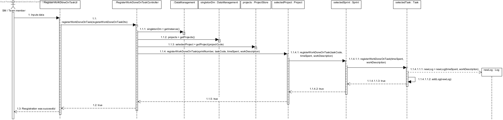
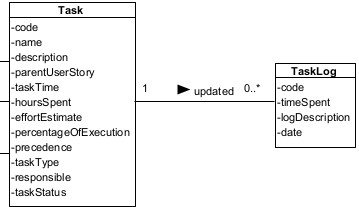
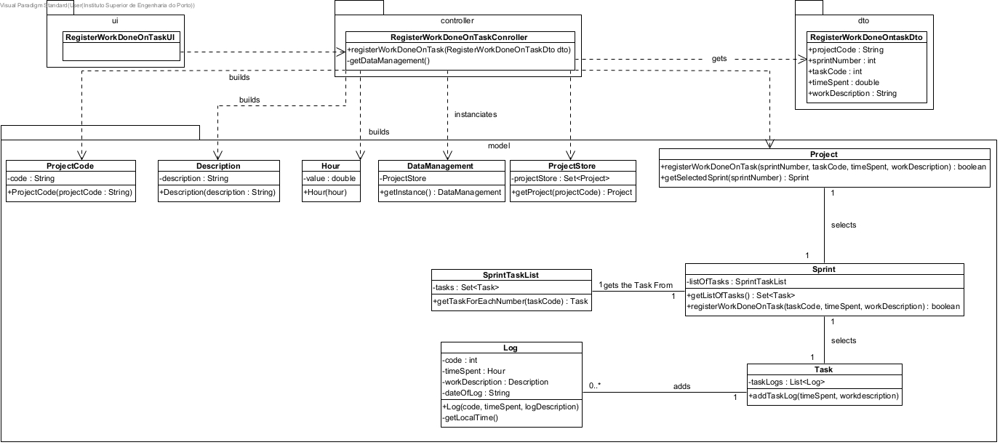
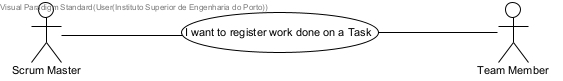
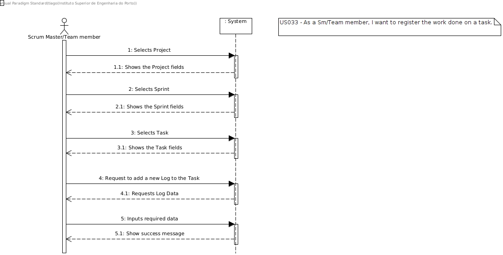

#### [Return Home](/docs/README.md)

# US033 - As SM/Team Member, I want to register work done on a Task

---

# 1. Requirements

### 1.1. User Story Description

As SM/Team Member, I want to register work done on a Task

### 1.2. Client Notes and Specifications

During the meetings with the product owner and through the analysis of the specifications, some notes/observations were
recorded:

- A scrum master or a team member should be able to register the work done on a task indicating:
    - the project and the sprint where the task is deployed;
    - it's name or designation
    - the amount of time in hours of the work session
    - a brief description of the work done

* According to our product owner we should allow for a task to have several records of the work done a task.

**From the client clarifications:**

> **Question:** *"Quando o SM/ Team Member querem registar o trabalho feito numa tarefa , regista-se apenas as horas despendidas , ou também registar/adicionar comentários? (G4, 30/01)"*
>
> **Answer:** *"Pode fazer sentido registar comentários. (AMM, 31/01)"

The sequence diagram for this US is presented below.

### 1.3. Dependencies with other User Stories

This User Story is dependent
of [031 - As Team Member, I want to create a task in a user story ](/docs/sprint-C/US031/US031.md)
and [032 - As SM/Team Member, I want to create task outside the scope of a user story ](/docs/sprint-C/US032/US032.md),
these user stories have the bigger share of responsibility with Task class.

---

# 2. Analysis

### 2.1. Business Rules

The task log, and it's value objects have the following business rules:

| **_Value Objects_**  | **_Business Rules_**                                   |
|:---------------------|:-------------------------------------------------------|
| **Time Spent**       | Mandatory, a double, and must be positive.             |
| **Work Description** | Mandatory, alphanumerical within 50 to 150 characters. |
| **Project Code**     | Mandatory, alphanumerical with 5 characters.           |
| **Sprint Number**    | Mandatory, an int, and must be positive.               |
| **Task Code**        | Mandatory, an int, and must be positive.               |

### 2.2. Excerpt of the Relevant Domain Model

The following is the domain model excerpt considered relevant to this US.

### 2.2. Other remarks

The team decided to add the local system date to the log attributes in order to better organize them.

---

# 3. Design

### 3.1. Sequence Diagram

This user story starts with a scrum master or team member wanting to register the work done in a given task, for this to
be possible they must indicate the project of the task, identified by the project code, the sprint of the task,
identified by the sprint number, and the task itself, identified by the task code. These parameters are needed for the
identification of the task. Having done that we add a new log instance to the task. This new Log will have the time
spent on the work session as indicated by the actor, and a brief description of the work done, registered by the acor.
The system then adds a code to the log and the date of the record.

### 3.2. Class diagram

### 3.3. Use-Case diagram

In this project, most user stories represent an unique interaction between one or more actors and the our system. This
user story reflect the case where a scrum master or a team member wants register the work done on a task, as it shown
bellow.

### 3.4. System sequence diagram

The following system sequence diagram represents the success case for the interaction of the user and the system regarding this functionality.

### 3.5. Testing

In order to answer to the identified business rules, some tests to the Domain had to be defined, in order to guarantee
that those rules are respected and answered by the code to be developed.

#### 3.5.1. Unit tests

The unit tests are defined below, organised by the corresponding classes:

- **RegisterWorkDoneOnTaskController**

    - **Unit Test 1:** Check that it is possible to create and add a log to a task when all value objects are valid.
    - **Unit Test 2:** Check that it is not possible to create and add a log to a task when the value object**Project
      Code** is null.
    - **Unit Test 3:** Check that it is not possible to create and add a log to a task when the value object**Project
      Code** is not correspondent to any project in store.
    - **Unit Test 4:** Check that it is not possible to create and add a log to a task when the value object**Project
      Code** does not meet the business rules.
    - **Unit Test 5:** Check that it is not possible to create and add a log to a task when the value object**Sprint
      Number** is negative.
    - **Unit Test 6:** Check that it is not possible to create and add a log to a task when the value object**Sprint
      Number** is not correspondent to any Sprint in the Project.
    - **Unit Test 7:** Check that it is not possible to create and add a log to a task when the value object**Task
      Code** is negative.
    - **Unit Test 8:** Check that it is not possible to create and add a log to a task when the value object**Task
      Code** is not correspondent to any Task in the Sprint.
    - **Unit Test 7:** Check that it is not possible to create and add a log to a task when the value object**Time
      Spent** is negative.

- **Project**

    - **Unit Test 1:** Check that it is not possible to create and add a log to a task when the value object**Sprint
      Number** is not correspondent to any Sprint in the Project.
    - **Unit Test 2:** Check that it is possible to create and add a log to a task when the value object**Sprint
      Number** is correspondent to a Sprint in the Project.

- **Sprint**

    - **Unit Test 1:** Check that it is not possible to create and add a log to a task when the value object**Task
      Code** is not correspondent to any Task in the Sprint.
    - **Unit Test 2:** Check that it is possible to create and add a log to a task when the value object**Task Code** is
      correspondent to a Task in the Sprint.

- **Task**

    - **Unit Test 1:** Check that it is possible to create and add a log to a task when the value object**Time Spent**
      is positive.
    - **Unit Test 2:** Check that it is not possible to create and add a log to a task when the value object**Time
      Spent** is not positive.

--- 

# 4. Implementation

This particular functionality was already present in our Domain Model, and therefore the implementation pretty
straightforward. Some changes were needed to better accommodate the client needs, namely, the addition of the local
system date. This feature allows the client to have a better knowledge and understanding of the log created.

Throughout the project we implemented GRASP and SOLID principles. Firstly, the controller has the responsibility to
instantiate the DataManagement Class, that is the information expert regarding all stores. The Controller also was found
to be a proper creator of some value objects, namely the Project Code, the Hour and the Description. The Controller also
has the responsibility of selecting the Project in the Project Code. After the Project is selected, the controller
delegates to the Project the responsibility of selecting the correct Sprint, since the project has knowledge of all it's
Sprints. The project then delegates the responsibility of selecting the correct Task, since the Sprint has knowledge of
all it's tasks. The Task now has the responsibility of creating the log and adding it to the Log List, since each Task
has his own Log list.

---

# 5. Integration

At this moment, User Stories that depend on the development of this one have not yet been required by the client, so
their integration with the other system functionalities cannot yet be tested/verified.

---

# 6. Observations

To sum up, the work done was positive, allowing the group to better understand and apply GRASP principles

This functionality revealed some frailties in our project structure, namely, the lack of a individual Sprint number
class, that allows a better validation and regulation of Sprint identifier.

