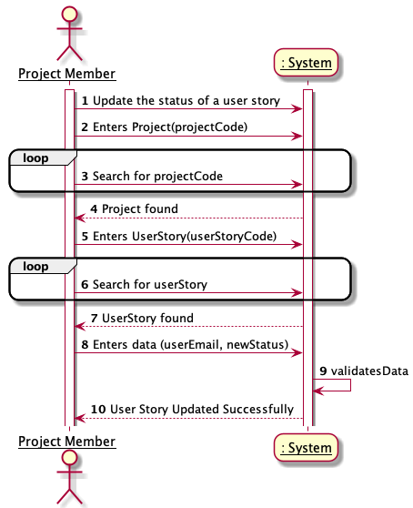
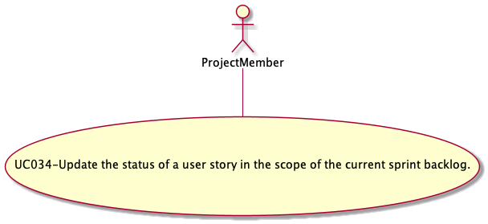

#### [Return Home](/docs/README.md)

# US034 - As Team Member, I want to update the status (i.e: the Scrum Board category) of a user story in the scope of the current sprint backlog.
=======================================

## **1.Requirements Engineering**

### **1.1. User Story Description**

As Team Member, I want to update the status (i.e: the Scrum Board category) of a user story in the scope of the current
sprint backlog.

### **1.2. Customer Specifications and Clarifications**

**From the specifications document:**

- User Story requirements not specified in the specifications documents.

**From the client clarifications:**

> **Question:** *Quando damos por concluída uma US, é necessário verificar o estados das Task's da US (caso existam) e
> bloquear a alteração de Status da US caso as Task's não estejam concluídas? Ou pelo contrario mudamos o estado à US e
> às respetivas Task's?*
>
> **Answer PO:** *"Numa primeira abordagem não será necessário verificar se há tasks por concluir."*
> (cf. https://bitbucket.org/switch-2021/project_wiki/wiki/User%20Stories)

**From Group Discussion:**

After meeting with the Product Owner and meeting in group we achieved the following conclusions:

- Each sprint has a "sprint backlog", i.e. the set of user stories that should be addressed during the sprint.
- A user story, in addition to its description, code, effort and priority, also has an associated status.
- The user story is created in the product backlog in the planned status and after being moved to the sprint backlog it
  can be changed.
- The user story status update id done by the team members.
- A user story has four different status:  *Planned*, *Running*, *Blocked* and *Finished*.
- The status of a user story within the sprint backlog can be changed to any status, with no restrictions whatsoever.

### **1.3. Acceptance Criteria**

* **AC1:** A team member must be able to update the status of a user story.
* **AC2:** All attributes must be filled.
* **AC3:** The user email must correspond with a team member in the selected project.
* **AC4:** The project code must correspond with a project present in the project store.
* **AC5:** A sprint must be currently running in the project.
* **AC6:** The user story code must match an existing user story in the sprint backlog.
* **AC7:** The new status to be associated must exist in the user story status list.

### **1.4. Found out Dependencies**

* There is a dependency to the [**US023** - *"As Team Member, I want to add a user story in the product backlog to the
  sprint backlog."*](/docs/sprint-B/US023). Moving a user story from the product backlog to the sprint backlog will
  allow the user to change the status.

### **1.5. Input and Output Data**

#### **Input Data:**

* **Typed data:**
    - User email;
    - Project code;
    - User story code;
    - New status;

* **Selected data:**
    - Selected project from a list of projects;
    - Current Sprint from the project sprint list of the project;
    - Selected a status from the user story status list;
    - Selected user story from a list of user stories to which the task was created for:

#### **Output Data:**

- Success or unsuccess of the operation.

### **1.6. System Sequence Diagram (SSD)**

### 1.7 Other Relevant Remarks

n/a

## 2. OO Analysis

Update user story status and it's value objects have the following business rules:

| **_Value Objects_**       | **_Business Rules_**                                                        |
|:--------------------------|:----------------------------------------------------------------------------|
| **ProjectCode**           | Alphanumerical with 5 characters.                                           |
| **Email**                 | Must follow the standard rules for an email.                                | 
| **UserStotyCode**         | Alphanumeric that must start with "US" followed by the user story number.   |
| **NewStatus**             | Text length between 4 and 50 characters.                                    |

### 2.1. Relevant Domain Model Excerpt

The following is the domain model excerpt considered relevant to this US.

## 3. Design - User Story Realization

## 3.1. Sequence Diagram (SD)

This user story starts when a team member wants to change a user story status in the sprint backlog. For this, the
project to be accessed must be indicated, the user story to be changed and the new status to be assigned must be
indicated. The email must also be given to validate that the human resource belongs to the team member of the same
project. If all these requirements are met, the operation will be successful.

## 3.2. Class Diagram (CD)

## 3.3. Use-Case Diagram

This User Story represents the case where a User with the role of Team Member wants to update the status of a user story
in the scope of the current sprint backlog.

# 4. Tests

Test scenarios created for this US.

**TEST 1:** Update user story status successfully.

**TEST 2:** Update user story status unsuccessfully because the requested project does not exist.

**TEST 3:** Update user story status unsuccessfully due to human resource not belonging to the project.

**TEST 4:** Update user story status unsuccessfully due to user story not existing in current sprint backlog.

**TEST 5:** Update user story status unsuccessfully due to non-existence of the status entered in the list of available
statuses.

**TEST 6:** Update user story status unsuccessfully due to param null.

**TEST 7:** Update user story status unsuccessfully because the human resource, as product owner, is not able to do this
action.

# 5. Construction (Implementation)

# 6. Integration and Demo

# 7. Observations

n/a

